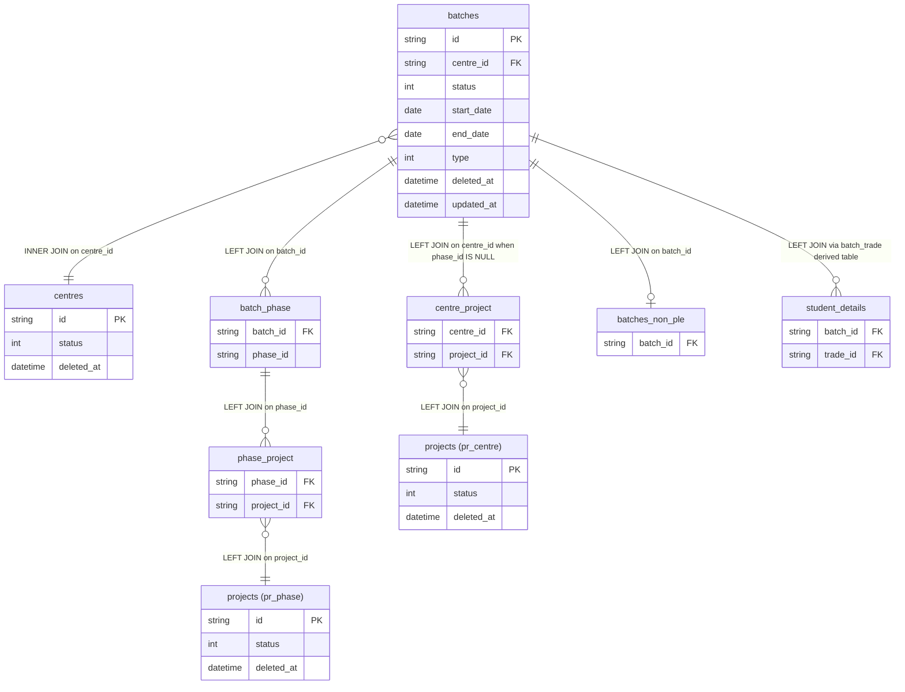

# dim_batch Query Column Documentation

Source query: `queries/dim_batch.sql`

This query produces batch-level records for active centres and non-deleted batches, with project mapping resolved from phase first and centre fallback second. The query is intended to populate or validate the DWH dimension `dim_batch`.

## Query Grain

One row per distinct combination of:

- Batch
- Phase mapping, when available
- Resolved project
- Trade mapped through student details

The final `LEFT JOIN` to `batch_trade` can create more than one row per batch when the same batch has students mapped to multiple trades.

## Global Filters

| Filter | Reason |
| --- | --- |
| `c.id = '54df26ad-0b01-4bed-8470-27d5ae3a63e0'` | Restricts output to one centre. Remove or parameterize this for a full `dim_batch` load. |
| `c.status = 1` | Includes only active centres. |
| `c.deleted_at IS NULL` | Excludes soft-deleted centres. |
| `b.status != 4` | Excludes batches with status `4`; based on the query this status is treated as inactive, closed, cancelled, or otherwise out of reporting scope. |
| `b.deleted_at IS NULL` | Excludes soft-deleted batches. |
| `pr_phase.status = 1`, `pr_phase.deleted_at IS NULL` | Uses only active, non-deleted projects for phase-based mapping. |
| `pr_centre.status = 1`, `pr_centre.deleted_at IS NULL` | Uses only active, non-deleted projects for centre fallback mapping. |
| `sd.batch_id IS NOT NULL`, `sd.trade_id IS NOT NULL` | Keeps only valid batch-to-trade mappings from student details. |

## Output Columns

Nullability below is based on the query logic, not the physical database schema. "Nullable in query" means the SQL can return `NULL` for that output column.

| Output column | Source table | Source column | Transform / logic | Reason for inclusion | Nullable in query | DWH table | DWH column | Source is DWH? |
| --- | --- | --- | --- | --- | --- | --- | --- | --- |
| `batch_id` | `quest_rearch_production.batches` alias `b` | `id` | Direct select: `b.id AS batch_id` | Primary batch identifier and natural source key for the batch dimension. Used to join phase, PLE, and trade mappings. | No, assuming `b.id` is the source primary key. | `dim_batch` | `batch_id` | No, source is production schema. |
| `batch_name` | `quest_rearch_production.batches` alias `b` | `name` | Direct select: `b.name AS batch_name` | Human-readable batch name for reporting, filtering, and validation. | Depends on source schema; the query does not enforce non-null. | `dim_batch` | `batch_name` | No, source is production schema. |
| `centre_id` | `quest_rearch_production.centres` alias `c` | `id` | Direct select after inner join: `c.id AS centre_id` | Identifies the active centre associated with the batch. Also enforces the active-centre filter. | No, because `centres` is inner joined by `c.id = b.centre_id`; assumes `c.id` is the source primary key. | `dim_batch` | `centre_id` | No, source is production schema. |
| `phase_id` | `quest_rearch_production.batch_phase` alias `bp` | `phase_id` | Direct select from left join: `bp.phase_id AS phase_id` | Captures the phase mapped to the batch when such a mapping exists. Drives primary project mapping through `phase_project`. | Yes. `batch_phase` is left joined, so batches without phase mapping return `NULL`. | `dim_batch` | `phase_id` | No, source is production schema. |
| `project_id` | `quest_rearch_production.projects` aliases `pr_phase`, `pr_centre` | `id` | `COALESCE(pr_phase.id, pr_centre.id) AS project_id` | Resolves the correct project for the batch. Phase-based project is preferred. Centre-based project is used only when `bp.phase_id IS NULL`. | Yes. Can be `NULL` if no active, non-deleted phase project exists and no eligible centre fallback project exists. | `dim_batch` | `project_id` | No, source is production schema. |
| `start_date` | `quest_rearch_production.batches` alias `b` | `start_date` | Direct select: `b.start_date AS start_date` | Batch start date for time-based reporting and lifecycle analysis. | Depends on source schema; the query does not enforce non-null. | `dim_batch` | `start_date` | No, source is production schema. |
| `end_date` | `quest_rearch_production.batches` alias `b` | `end_date` | Direct select: `b.end_date AS end_date` | Batch end date for time-based reporting and lifecycle analysis. | Depends on source schema; the query does not enforce non-null. | `dim_batch` | `end_date` | No, source is production schema. |
| `batch_type` | `quest_rearch_production.batches` alias `b` | `type` | Direct select with rename: `b.type AS batch_type` | Classifies the batch type for segmentation and reporting. Renamed to avoid generic column name `type` in the DWH. | Depends on source schema; the query does not enforce non-null. | `dim_batch` | `batch_type` | No, source is production schema. |
| `is_ple` | `quest_rearch_production.batches_non_ple` alias `bnp` | `batch_id` | `CASE WHEN bnp.batch_id IS NULL THEN 1 ELSE 0 END AS is_ple` | Flags whether a batch is PLE. If no record exists in `batches_non_ple`, the batch is treated as PLE. If a record exists, it is non-PLE. | No. CASE always returns `1` or `0`. | `dim_batch` | `is_ple` | No, source is production schema. |
| `status` | `quest_rearch_production.batches` alias `b` | `status` | Direct select: `b.status` after `b.status != 4` filter | Preserves batch status for reporting while excluding status `4` records from the dimension output. | No if source `b.status` is non-null. The `b.status != 4` predicate also excludes `NULL` statuses in SQL three-valued logic. | `dim_batch` | `status` | No, source is production schema. |
| `trade_id` | `quest_rearch_production.student_details` alias `sd` via derived table `batch_trade` | `trade_id` | Select distinct batch-trade pairs where both IDs are non-null, then left join to batch output by `batch_id`. | Adds trade mapping observed from student records. A batch can map to multiple trades, so this can increase row count. | Yes. Final join is left joined, so batches with no valid student trade mapping return `NULL`. | `dim_batch` | `trade_id` | No, source is production schema. |

## Entity Relationship Diagram



## Project Mapping Logic

The query intentionally prevents incorrect project duplication caused by centre-level project mappings.

Primary mapping:

```sql
batches b
LEFT JOIN batch_phase bp ON bp.batch_id = b.id
LEFT JOIN phase_project pp ON pp.phase_id = bp.phase_id
LEFT JOIN projects pr_phase ON pr_phase.id = pp.project_id
```

Fallback mapping:

```sql
LEFT JOIN centre_project cp
    ON cp.centre_id = b.centre_id
   AND bp.phase_id IS NULL
LEFT JOIN projects pr_centre
    ON pr_centre.id = cp.project_id
```

Resolved project:

```sql
COALESCE(pr_phase.id, pr_centre.id) AS project_id
```

Reason:

- If a batch has a phase, the phase-to-project relationship is the authoritative mapping.
- If a batch has no phase, centre-to-project is used as fallback.
- The condition `AND bp.phase_id IS NULL` prevents centre projects from being joined for phase-mapped batches, which avoids duplicate or incorrect project assignments when a centre has multiple projects.

## Join and Cardinality Notes

| Join | Join type | Expected effect |
| --- | --- | --- |
| `batches` to `batch_phase` | `LEFT JOIN` | Preserves batches even when no phase mapping exists. |
| `batch_phase` to `phase_project` | `LEFT JOIN` | Preserves batches even when phase has no project mapping. |
| `phase_project` to `projects pr_phase` | `LEFT JOIN` | Keeps only active, non-deleted phase projects while preserving the batch row. |
| `batches` to `centre_project` | `LEFT JOIN`, only when `bp.phase_id IS NULL` | Provides fallback project mapping only for batches without phase mapping. |
| `centre_project` to `projects pr_centre` | `LEFT JOIN` | Keeps only active, non-deleted centre projects while preserving the batch row. |
| `batches` to `batches_non_ple` | `LEFT JOIN` | Enables `is_ple` flag while preserving all eligible batches. |
| `batches` to `centres` | `INNER JOIN` | Excludes batches without an active, non-deleted centre. |
| Batch output to `batch_trade` | `LEFT JOIN` | Preserves batch rows even when no trade is found; may duplicate batch rows when multiple trades exist. |

## DWH Interpretation

| Item | Value |
| --- | --- |
| Intended DWH table | `dim_batch` |
| DWH grain risk | `trade_id` can make the output more granular than one row per batch. If `dim_batch` must be strictly one row per batch, trade should either move to a bridge table such as `bridge_batch_trade` or be aggregated before joining. |
| Production source schema | `quest_rearch_production` |
| DWH source status | The query reads from production source tables, not DWH tables. |
| Output DWH columns | `batch_id`, `batch_name`, `centre_id`, `phase_id`, `project_id`, `start_date`, `end_date`, `batch_type`, `is_ple`, `status`, `trade_id` |
