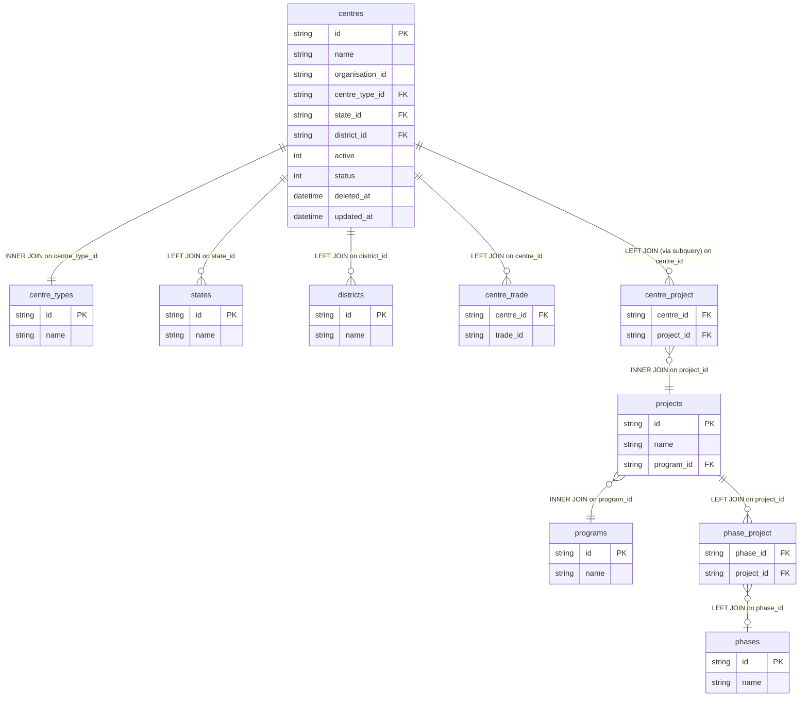

# dim_centre Query Documentation

Source query: `queries/dim_centre.sql`

This query produces one record per centre, combining the centre's core attributes with its type, resolved state/district names, a JSON array of associated trade IDs, and a JSON array of the projects/programs/phases the centre is mapped to. It is intended to populate the DWH dimension `dim_centre`, providing a denormalised view of each centre's identity, location, trade portfolio, and project/program/phase associations for use as a conformed dimension across fact tables.

## Query Grain

One row per centre (`centre_id`). The `GROUP BY` on the centre's core columns plus the two pre-aggregated JSON subqueries (`trade_ids` and `projects`) collapse the one-to-many relationships between centres and trades/projects, so there is no fan-out risk in the final output. Each centre appears exactly once regardless of how many trades or projects it is associated with.

## Incremental Configuration

| Setting | Value | Reason |
| --- | --- | --- |
| Source table | `quest_rearch_production.centres` | Centre identity and `updated_at` are driven from the centre record. |
| Source ID column (`id_col`) | `id` | Source primary key used by the pipeline to identify changed records. |
| Destination ID column (`dest_id_col`) | `centre_id` | Output column used by the pipeline to delete and reload changed centre rows. |
| Updated-at column | `updated_at` | Used by the pipeline to detect changed centres for incremental refresh. |

## Global Filters

| Filter | Reason |
| --- | --- |
| `c.deleted_at IS NULL` | Excludes soft-deleted centres. |
| `c.status = 1` | Only includes active centres. |

## Output Columns

| Output column | Source table | Source column | Transform / logic | Reason for inclusion | Nullable in query |
| --- | --- | --- | --- | --- | --- |
| `centre_id` | `quest_rearch_production.centres` alias `c` | `id` | Direct select: `c.id AS centre_id` | Primary centre identifier and natural source key for the dimension. | No |
| `centre_name` | `quest_rearch_production.centres` alias `c` | `name` | Direct select: `c.name AS centre_name` | Human-readable centre name for reporting and filtering. | Depends on source schema |
| `organisation_id` | `quest_rearch_production.centres` alias `c` | `organisation_id` | Direct select: `c.organisation_id` | Links the centre to its parent organisation for org-level aggregation. | Depends on source schema |
| `centre_type` | `quest_rearch_production.centre_types` alias `ct` | `name` | Direct lookup via INNER JOIN on `c.centre_type_id`: `ct.name AS centre_type` | Provides the readable centre type classification. | No — `centre_types` is INNER joined, so centres without a matching type are excluded. |
| `state_name` | `quest_rearch_production.states` alias `s` | `name` | LEFT JOIN lookup on `c.state_id`: `s.name AS state_name` | Human-readable state name for geography reporting. | Yes — `states` is LEFT joined. |
| `district_name` | `quest_rearch_production.districts` alias `d` | `name` | LEFT JOIN lookup on `c.district_id`: `d.name AS district_name` | Human-readable district name for geography reporting. | Yes — `districts` is LEFT joined. |
| `trade_ids` | `quest_rearch_production.centre_trade` alias `ct2` | `trade_id` | `JSON_ARRAYAGG(ct2.trade_id)` over LEFT joined rows | Aggregates all trades associated with the centre into a JSON array. Avoids fan-out. Returns `NULL` or `[null]` if no trades exist. | Yes — `centre_trade` is LEFT joined. |
| `projects` | `quest_rearch_production.centre_project`, `projects`, `programs`, `phase_project`, `phases` | see subquery | `JSON_ARRAYAGG(JSON_OBJECT('project_id', ..., 'project_name', ..., 'program_id', ..., 'program_name', ..., 'phase_id', ..., 'phase_name', ...))`, computed per-centre in a `LEFT JOIN` subquery aliased `pagg` | Denormalises every project/program/phase combination a centre is mapped to into a single JSON array, avoiding row fan-out on the outer query. Phase is resolved via the `phase_project` junction table (`phases` has no direct `project_id` column) and is `LEFT JOIN`ed since not every project has a phase mapping. | Yes — the whole subquery is `LEFT JOIN`ed, and phase fields within each JSON object can be `null`. |
| `active` | `quest_rearch_production.centres` alias `c` | `active` | Direct select: `c.active` | Indicates whether the centre is currently active; used for downstream filtering. | Depends on source schema |
| `updated_at` | `quest_rearch_production.centres` alias `c` | `updated_at` | Direct select: `c.updated_at` | Supports auditability and incremental refresh tracking. | Depends on source schema |

## Entity Relationship Diagram

## Join and Cardinality Notes

| Join | Join type | Expected effect |
| --- | --- | --- |
| `centres` to `centre_types` | `INNER JOIN` | Excludes centres that have no matching centre type. Each centre maps to exactly one type. |
| `centres` to `states` | `LEFT JOIN` | Preserves centres with no state mapping; `state_name` is `NULL` in that case. |
| `centres` to `districts` | `LEFT JOIN` | Preserves centres with no district mapping; `district_name` is `NULL` in that case. |
| `centres` to `centre_trade` | `LEFT JOIN` | Preserves centres with no trade mapping. Multiple trade rows per centre are collapsed into a JSON array by `GROUP BY` + `JSON_ARRAYAGG`. |
| `centre_project` to `projects` to `programs` (inside `pagg` subquery) | `INNER JOIN` | A project without a resolvable program is excluded from the `projects` JSON array for that centre. |
| `projects` to `phase_project` to `phases` (inside `pagg` subquery) | `LEFT JOIN` | A project with no phase mapping still appears in the `projects` array, with `phase_id`/`phase_name` as `null`. `phases` has no direct `project_id` column — it is resolved through the `phase_project` junction table. |
| `centres` to the `pagg` subquery | `LEFT JOIN` | Preserves centres with no project mapping; `projects` is `NULL` in that case. |

## DWH Interpretation

| Item | Value |
| --- | --- |
| Intended DWH table | `dim_centre` |
| DWH grain risk | No fan-out risk. The `GROUP BY` on the centre's core columns plus the pre-aggregated `pagg` subquery ensures one row per centre. Both `trade_ids` and `projects` are stored as JSON rather than expanding rows. |
| Production source schema | `quest_rearch_production` |
| DWH source status | The query reads from production source tables, not DWH tables. |
| Output DWH columns | `centre_id`, `centre_name`, `organisation_id`, `centre_type`, `state_name`, `district_name`, `trade_ids`, `projects`, `active`, `updated_at` |
