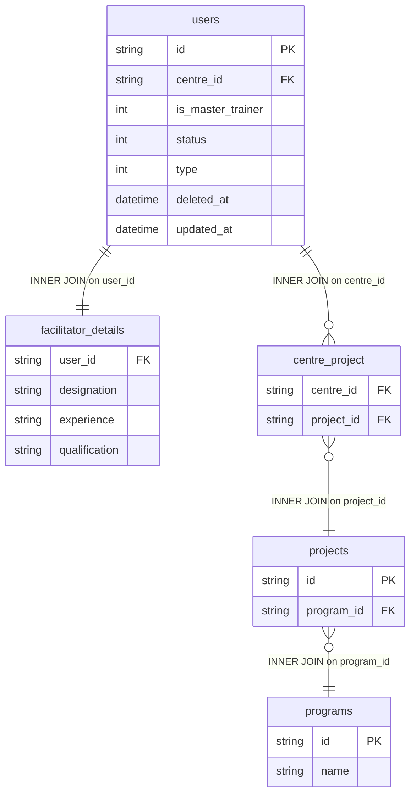

# dim_educator Query Documentation

Source query: `queries/dim_educator.sql`

This query produces records for active, non-deleted facilitator users, combining user identity from `users` with professional profile attributes from `facilitator_details` and the program mapped to the educator's centre. It is intended to populate the DWH dimension `dim_educator`, providing educator profile data for use in fact table joins and workforce reporting.

## Query Grain

Intended grain: one row per educator (`educator_id`). However, the join path `users -> centre_project -> projects -> programs` can produce multiple rows per educator when the educator's centre is mapped to more than one project or program. If `dim_educator` must be strictly one row per educator, a deterministic rule is needed to select one program per centre or aggregate before loading.

## Incremental Configuration

| Setting | Value | Reason |
| --- | --- | --- |
| Source table | `quest_rearch_production.users` | Educator identity and `updated_at` are driven from the user record. |
| Source ID column (`id_col`) | `id` | Source primary key used by the pipeline to identify changed records. |
| Destination ID column (`dest_id_col`) | `educator_id` | Output column used by the pipeline to delete and reload changed educator rows. |
| Updated-at column | `updated_at` | Used by the pipeline to detect changed educators for incremental refresh. |

## Global Filters

| Filter | Reason |
| --- | --- |
| `u.status = 1` | Includes only active users. |
| `u.deleted_at IS NULL` | Excludes soft-deleted users. |
| `u.type = 2` | Restricts to user type 2 (facilitator/educator role). |

## Output Columns

| Output column | Source table | Source column | Transform / logic | Reason for inclusion | Nullable in query |
| --- | --- | --- | --- | --- | --- |
| `educator_id` | `quest_rearch_production.users` alias `u` | `id` | Direct select: `u.id AS educator_id` | Primary educator identifier and natural source key for the dimension. | No |
| `designation` | `quest_rearch_production.facilitator_details` alias `fd` | `designation` | Direct select: `fd.designation AS designation` | Educator's job title or designation for workforce segmentation. | No — `facilitator_details` is INNER joined; educators without a details record are excluded. |
| `experience_yrs` | `quest_rearch_production.facilitator_details` alias `fd` | `experience` | Direct select: `fd.experience AS experience_yrs` | Years of experience; supports educator profiling and analytics. | Depends on source schema |
| `qualification` | `quest_rearch_production.facilitator_details` alias `fd` | `qualification` | Direct select: `fd.qualification AS qualification` | Educational qualification of the educator. | Depends on source schema |
| `mastercoach_flag` | `quest_rearch_production.users` alias `u` | `is_master_trainer` | Direct select: `u.is_master_trainer AS mastercoach_flag` | Indicates whether the educator is a master trainer/coach. | Depends on source schema |
| `centre_id` | `quest_rearch_production.users` alias `u` | `centre_id` | Direct select: `u.centre_id` | Links the educator to their assigned centre for centre-level aggregation. | Depends on source schema |
| `program_id` | `quest_rearch_production.programs` alias `p` | `id` | Resolved via `users.centre_id -> centre_project -> projects -> programs`: `p.id AS program_id` | Associates the educator with the program delivered at their centre. | No — all joins are INNER; educators without a full centre-to-program path are excluded. |
| `updated_at` | `quest_rearch_production.users` alias `u` | `updated_at` | Direct select: `u.updated_at` | Supports auditability and incremental refresh tracking. | Depends on source schema |

## Entity Relationship Diagram

## Join and Cardinality Notes

| Join | Join type | Expected effect |
| --- | --- | --- |
| `users` to `facilitator_details` | `INNER JOIN` | Excludes users that have no facilitator profile record. |
| `users` to `centre_project` | `INNER JOIN` | Excludes educators whose centre has no project mapping. Can multiply rows if a centre maps to multiple projects. |
| `centre_project` to `projects` | `INNER JOIN` | Resolves project records. |
| `projects` to `programs` | `INNER JOIN` | Resolves program name from the mapped project. Can multiply rows if a project maps to multiple programs. |

## DWH Interpretation

| Item | Value |
| --- | --- |
| Intended DWH table | `dim_educator` |
| DWH grain risk | `centre_project` can produce multiple rows per educator if the educator's centre maps to more than one project or program. Deduplicate or aggregate before loading to `dim_educator` if one-row-per-educator is required. |
| Production source schema | `quest_rearch_production` |
| DWH source status | The query reads from production source tables, not DWH tables. |
| Output DWH columns | `educator_id`, `designation`, `experience_yrs`, `qualification`, `mastercoach_flag`, `centre_id`, `program_id`, `updated_at` |
