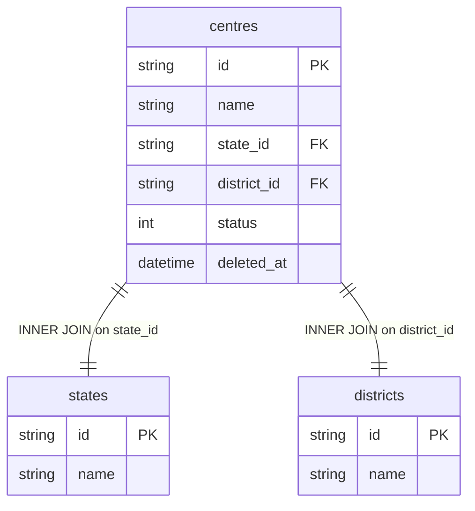

# dim_geography Query Documentation

Source query: `queries/dim_geography.sql`

This query produces a centre-level geography lookup, resolving each active centre's state and district names. It is intended to support geography-level reporting (state/district roll-ups) without repeating the state/district join logic in every fact or dimension query that needs it.

## Query Grain

One row per centre (`centre_id`). Each centre has exactly one state and one district via `INNER JOIN`, so there is no fan-out.

## Incremental Configuration

This query has **no `-- @incremental` header**, so it always runs as a full replace — there is no incremental mode configured. Consider adding:

```sql
-- @incremental source_table=quest_rearch_production.centres id_col=id updated_at_col=updated_at dest_id_col=centre_id
```

if incremental refresh is desired (matches the pattern used by `dim_centre`).

## Global Filters

| Filter | Reason |
| --- | --- |
| `c.status = 1` | Only includes active centres. |
| `c.deleted_at IS NULL` | Excludes soft-deleted centres. |

## Output Columns

| Output column | Source table | Source column | Transform / logic | Reason for inclusion | Nullable in query |
| --- | --- | --- | --- | --- | --- |
| `centre_id` | `quest_rearch_production.centres` alias `c` | `id` | Direct select: `c.id AS centre_id` | Primary centre identifier. | No |
| `centre` | `quest_rearch_production.centres` alias `c` | `name` | Direct select: `c.name AS centre` | Human-readable centre name. | Depends on source schema |
| `district` | `quest_rearch_production.districts` alias `d` | `name` | INNER JOIN lookup on `c.district_id`: `d.name AS district` | Human-readable district name for geography roll-ups. | No — `districts` is INNER joined, so centres without a matching district are excluded. |
| `state` | `quest_rearch_production.states` alias `s` | `name` | INNER JOIN lookup on `c.state_id`: `s.name AS state` | Human-readable state name for geography roll-ups. | No — `states` is INNER joined, so centres without a matching state are excluded. |

> **Note:** `district_id` and `state_id` are commented out in the `SELECT` (only the resolved names are output). Uncomment if downstream consumers need the raw IDs alongside the names.

## Entity Relationship Diagram



## Join and Cardinality Notes

| Join | Join type | Expected effect |
| --- | --- | --- |
| `centres` to `states` | `INNER JOIN` | Excludes centres with no matching state. Each centre maps to exactly one state. |
| `centres` to `districts` | `INNER JOIN` | Excludes centres with no matching district. Each centre maps to exactly one district. |

## DWH Interpretation

| Item | Value |
| --- | --- |
| Intended DWH table | `dim_geography` |
| DWH grain risk | None — both joins are one-to-one (INNER) on foreign keys, so the output is exactly one row per active centre. |
| Production source schema | `quest_rearch_production` |
| DWH source status | The query reads from production source tables, not DWH tables. |
| Output DWH columns | `centre_id`, `centre`, `district`, `state` |
