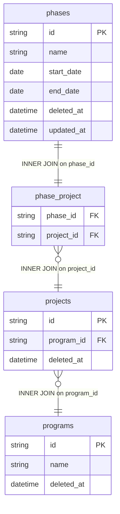

# dim_phase Query Documentation

Source query: `queries/dim_phase.sql`

This query produces one record per phase, resolving the phase's associated project and program through the `phase_project` bridge table. It is intended to populate the DWH dimension `dim_phase`, providing a time-bounded phase descriptor with a derived status flag for use in fact table joins and programme reporting.

## Query Grain

One row per phase (`phase_id`). The `phase_project` table is expected to map each phase to exactly one project; if that constraint is violated in the source, this query would produce multiple rows per phase. No GROUP BY is present, so a one-to-many in `phase_project` would cause fan-out.

## Incremental Configuration

| Setting | Value | Reason |
| --- | --- | --- |
| Source table | `quest_rearch_production.phases` | Phase identity and `updated_at` are driven from the phase record. |
| Source ID column (`id_col`) | `id` | Source primary key used by the pipeline to identify changed records. |
| Destination ID column (`dest_id_col`) | `phase_id` | Output column used by the pipeline to delete and reload changed phase rows. |
| Updated-at column | `updated_at` | Used by the pipeline to detect changed phases for incremental refresh. |

## Global Filters

| Filter | Reason |
| --- | --- |
| `p.deleted_at IS NULL` | Excludes soft-deleted phases. |
| `p2.deleted_at IS NULL` | Excludes phases linked to soft-deleted projects. |
| `p3.deleted_at IS NULL` | Excludes phases linked to projects under soft-deleted programs. |

## Output Columns

| Output column | Source table | Source column | Transform / logic | Reason for inclusion | Nullable in query |
| --- | --- | --- | --- | --- | --- |
| `phase_id` | `quest_rearch_production.phases` alias `p` | `id` | Direct select: `p.id AS phase_id` | Primary phase identifier and natural source key for the dimension. | No |
| `phase_name` | `quest_rearch_production.phases` alias `p` | `name` | Direct select: `p.name AS phase_name` | Human-readable phase name for reporting and filtering. | Depends on source schema |
| `program_id` | `quest_rearch_production.programs` alias `p3` | `id` | Resolved via `phases -> phase_project -> projects -> programs`: `p3.id AS program_id` | Links the phase to its parent program for program-level aggregation. | No — all joins are INNER. |
| `project_id` | `quest_rearch_production.projects` alias `p2` | `id` | Resolved via `phases -> phase_project -> projects`: `p2.id AS project_id` | Links the phase to its specific project. | No — all joins are INNER. |
| `start_date` | `quest_rearch_production.phases` alias `p` | `start_date` | Direct select: `p.start_date` | Phase start date for time-based reporting. | Depends on source schema |
| `end_date` | `quest_rearch_production.phases` alias `p` | `end_date` | Direct select: `p.end_date` | Phase end date for time-based reporting and status derivation. | Depends on source schema |
| `status` | `quest_rearch_production.phases` alias `p` | `end_date` | `CASE WHEN p.end_date <= CURDATE() THEN 2 ELSE 1 END AS status` — derived at query time | Classifies the phase as completed (2) or active (1) based on whether the end date is in the past. | No — CASE always returns 1 or 2. |
| `updated_at` | `quest_rearch_production.phases` alias `p` | `updated_at` | Direct select: `p.updated_at` | Supports auditability and incremental refresh tracking. | Depends on source schema |

## Entity Relationship Diagram

## Join and Cardinality Notes

| Join | Join type | Expected effect |
| --- | --- | --- |
| `phases` to `phase_project` | `INNER JOIN` | Excludes phases with no project mapping. Expected to be one-to-one; a one-to-many would cause fan-out. |
| `phase_project` to `projects` | `INNER JOIN` | Resolves the project record. Excludes phases linked to deleted projects via the `deleted_at` filter. |
| `projects` to `programs` | `INNER JOIN` | Resolves the program. Excludes phases in programs that are soft-deleted. |

## DWH Interpretation

| Item | Value |
| --- | --- |
| Intended DWH table | `dim_phase` |
| DWH grain risk | Assumes `phase_project` is a strict one-to-one mapping. If a phase maps to multiple projects, the output will fan out beyond one row per phase. |
| Production source schema | `quest_rearch_production` |
| DWH source status | The query reads from production source tables, not DWH tables. |
| Output DWH columns | `phase_id`, `phase_name`, `program_id`, `project_id`, `start_date`, `end_date`, `status`, `updated_at` |
