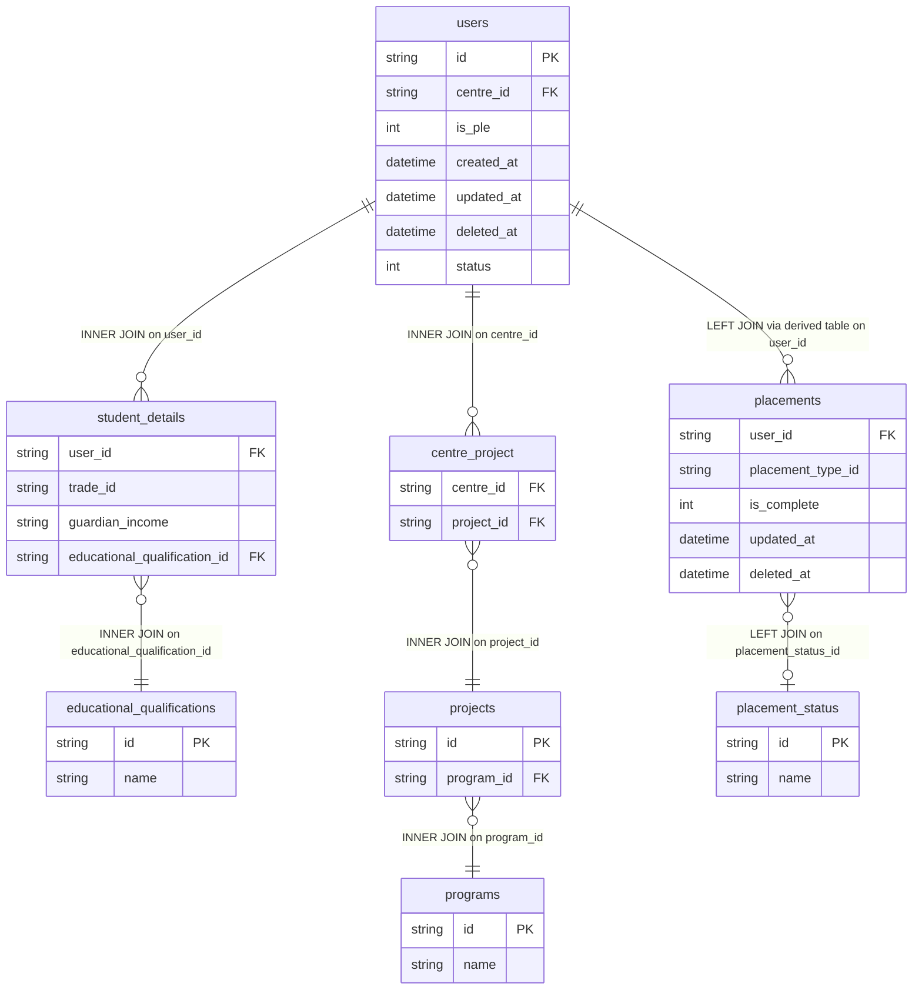

# dim_placement_learner Query Column Documentation

Source query: `queries/dim_placement_learner.sql`

This query produces learner-level profile records for the DWH dimension `dim_placement_learner`. It combines learner identity from `users`, student profile attributes from `student_details`, education lookup data, centre-to-program mapping, and the latest qualifying placement status at enrolment.

## Query Grain

Intended grain: one row per `learner_id`.

Important grain risk: the path `users -> centre_project -> projects -> programs` can create more than one row per learner when a learner's centre is linked to multiple projects or programs. If `dim_placement_learner` must be strictly one row per learner, a deterministic rule is needed to choose one project/program or aggregate the program mapping before loading.

## Incremental Configuration

| Setting | Value | Reason |
| --- | --- | --- |
| Source table | `quest_rearch_production.users` | Learner identity and `updated_at` are driven from the user record. |
| ID column | `learner_id` | Output column used by the pipeline to delete and reload changed learner rows. |
| Updated-at column | `updated_at` | Used by the pipeline to detect changed learners for incremental refresh. |

## Global Filters

| Filter | Reason |
| --- | --- |
| `pl.placement_type_id IN ('1627ed64-074f-4f92-9b6c-c7fb6aa0bc2c')` | Limits placement records to the placement type treated as enrolment employment status. |
| `pl.deleted_at IS NULL` | Excludes soft-deleted placement records. |
| `pl.user_id IS NOT NULL` | Ensures placement rows can be mapped back to learners. |
| `WHERE rn = 1` inside placement derived table | Keeps only the latest qualifying placement row per learner after ranking by `pl.updated_at DESC`. |

## Output Columns

Nullability below is based on the query logic, not the physical database schema. "Nullable in query" means the SQL can return `NULL` for that output column.

| Output column | Source table | Source column | Transform / logic | Reason for inclusion | Nullable in query | DWH table | DWH column | Source is DWH? |
| --- | --- | --- | --- | --- | --- | --- | --- | --- |
| `learner_id` | `quest_rearch_production.users` alias `u` | `id` | Direct select: `u.id AS learner_id` | Primary learner identifier and natural source key for `dim_placement_learner`. Used by incremental delete/reload logic. | No, assuming `u.id` is the source primary key. | `dim_placement_learner` | `learner_id` | No, source is production schema. |
| `educational_qualification` | `quest_rearch_production.educational_qualifications` alias `eq` | `name` | Direct lookup through `student_details.educational_qualification_id`: `eq.name AS educational_qualification` | Adds readable education level for learner segmentation and reporting. | No if the inner join finds a matching qualification; learners without a matching qualification are excluded by the join. | `dim_placement_learner` | `educational_qualification` | No, source is production schema. |
| `is_ple` | `quest_rearch_production.users` alias `u` | `is_ple` | Direct select: `u.is_ple` | Identifies whether the learner is mapped as PLE or non-PLE in the source user record. | Depends on source schema; the query does not enforce non-null. | `dim_placement_learner` | `is_ple` | No, source is production schema. |
| `trade_id` | `quest_rearch_production.student_details` alias `sd` | `trade_id` | Direct select: `sd.trade_id` | Captures the learner's trade mapping from the student profile. | Depends on source schema; the query does not enforce non-null. | `dim_placement_learner` | `trade_id` | No, source is production schema. |
| `employment_status_at_enrolment` | `quest_rearch_production.placement_status` alias `ps`, via `placements` alias `pl` | `ps.name` | Derived from latest qualifying placement row per learner using `ROW_NUMBER() OVER (PARTITION BY pl.user_id ORDER BY pl.updated_at DESC)` and `WHERE rn = 1`. | Provides the learner's most recent enrolment-related employment status for reporting. | Yes. The placement derived table is left joined, and `placement_status` is also left joined. | `dim_placement_learner` | `employment_status_at_enrolment` | No, source is production schema. |
| `family_income_band` | `quest_rearch_production.student_details` alias `sd` | `guardian_income` | Direct select with rename: `sd.guardian_income AS family_income_band` | Stores learner family income band using the guardian income field from student profile. | Depends on source schema; the query does not enforce non-null. | `dim_placement_learner` | `family_income_band` | No, source is production schema. |
| `first_program` | `quest_rearch_production.programs` alias `p` | `name` | Direct lookup through `users.centre_id -> centre_project -> projects -> programs`: `p.name AS first_program` | Adds the program associated with the learner's centre/project mapping. Named `first_program`, though the current query does not rank programs by date. | No if the inner joins find a matching centre, project, and program; learners without a mapping are excluded by the joins. | `dim_placement_learner` | `first_program` | No, source is production schema. |
| `first_enrolled_at` | `quest_rearch_production.users` alias `u` | `created_at` | Direct select with rename: `u.created_at AS first_enrolled_at` | Uses user creation time as the learner's first enrolment timestamp. | Depends on source schema; the query does not enforce non-null. | `dim_placement_learner` | `first_enrolled_at` | No, source is production schema. |
| `updated_at` | `quest_rearch_production.users` alias `u` | `updated_at` | Direct select: `u.updated_at` | Supports auditability and incremental refresh tracking. | Depends on source schema; the query does not enforce non-null. | `dim_placement_learner` | `updated_at` | No, source is production schema. |

## Join and Cardinality Notes

| Join | Join type | Expected effect |
| --- | --- | --- |
| `users` to `student_details` | `JOIN` | Keeps only users with a student details record. |
| `users` to `centre_project` | `JOIN` | Keeps only users whose centre has at least one project mapping. Can multiply rows when a centre has multiple project mappings. |
| `centre_project` to `projects` | `JOIN` | Resolves project records for the learner's centre mappings. |
| `projects` to `programs` | `JOIN` | Resolves program name from the mapped project. |
| `student_details` to `educational_qualifications` | `JOIN` | Keeps only learners with a matching education qualification lookup. |
| `users` to placement derived table `pd` | `LEFT JOIN` | Preserves learners even when no qualifying enrolment placement exists. |
| `placements` to `placement_status` | `LEFT JOIN` | Preserves placement rows even when status lookup is missing; status name can be `NULL`. |

## Entity Relationship Diagram



## Placement Status Logic

The employment status field is derived in two steps:

```sql
ROW_NUMBER() OVER (
    PARTITION BY pl.user_id
    ORDER BY pl.updated_at DESC
) AS rn
```

Then:

```sql
WHERE rn = 1
```

Reason:

- A learner can have multiple placement records.
- Only non-deleted placement rows for the configured enrolment placement type are considered.
- The latest updated qualifying placement record is used as the learner's employment status at enrolment.

## DWH Interpretation

| Item | Value |
| --- | --- |
| Intended DWH table | `dim_placement_learner` |
| DWH grain risk | `centre_project` can multiply learner rows if a centre maps to multiple projects/programs. |
| Production source schema | `quest_rearch_production` |
| DWH source status | The query reads from production source tables, not DWH tables. |
| Output DWH columns | `learner_id`, `educational_qualification`, `is_ple`, `trade_id`, `employment_status_at_enrolment`, `family_income_band`, `first_program`, `first_enrolled_at`, `updated_at` |
