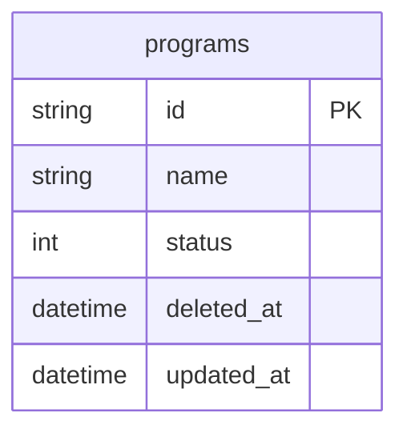

# dim_program Query Documentation

Source query: `queries/dim_program.sql`

This query produces a simple lookup table of active, non-deleted programs. It is intended to populate the DWH dimension `dim_program`, providing a minimal program descriptor for use as a conformed dimension in joins across batch, phase, educator, learner, and subject fact and dimension tables.

## Query Grain

One row per program (`program_id`). This is a single-table select with no joins, so there is no fan-out risk.

## Incremental Configuration

| Setting | Value | Reason |
| --- | --- | --- |
| Source table | `quest_rearch_production.programs` | Program identity and `updated_at` are driven from the program record. |
| Source ID column (`id_col`) | `id` | Source primary key used by the pipeline to identify changed records. |
| Destination ID column (`dest_id_col`) | `program_id` | Output column used by the pipeline to delete and reload changed program rows. |
| Updated-at column | `updated_at` | Used by the pipeline to detect changed programs for incremental refresh. |

## Global Filters

| Filter | Reason |
| --- | --- |
| `p.status = 1` | Includes only active programs. |
| `p.deleted_at IS NULL` | Excludes soft-deleted programs. |

## Output Columns

| Output column | Source table | Source column | Transform / logic | Reason for inclusion | Nullable in query |
| --- | --- | --- | --- | --- | --- |
| `program_id` | `quest_rearch_production.programs` alias `p` | `id` | Direct select: `p.id AS program_id` | Primary program identifier and natural source key for the dimension. | No |
| `name` | `quest_rearch_production.programs` alias `p` | `name` | Direct select: `p.name` | Human-readable program name for reporting and filtering. | Depends on source schema |
| `updated_at` | `quest_rearch_production.programs` alias `p` | `updated_at` | Direct select: `p.updated_at` | Supports auditability and incremental refresh tracking. | Depends on source schema |

## Entity Relationship Diagram

## Join and Cardinality Notes

| Join | Join type | Expected effect |
| --- | --- | --- |
| None | N/A | Single-table query; no joins. |

## DWH Interpretation

| Item | Value |
| --- | --- |
| Intended DWH table | `dim_program` |
| DWH grain risk | No fan-out risk. Single-table select with no joins. |
| Production source schema | `quest_rearch_production` |
| DWH source status | The query reads from production source tables, not DWH tables. |
| Output DWH columns | `program_id`, `name`, `updated_at` |
