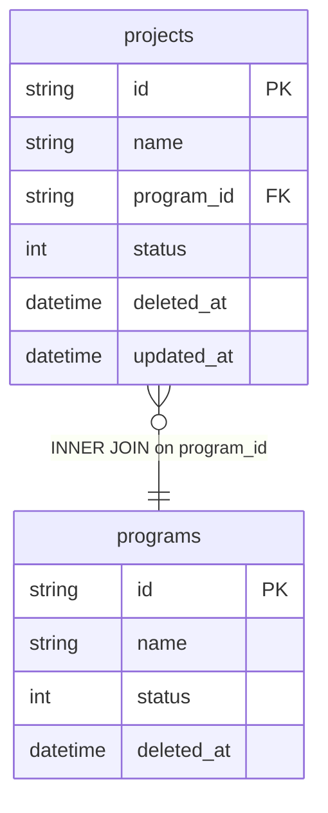

# dim_project Query Documentation

Source query: `queries/dim_project.sql`

This query produces one record per active, non-deleted project, joined to its parent program. It is intended to populate the DWH dimension `dim_project`, providing project and program identity for use as a foreign key in fact table joins and for program-level reporting.

## Query Grain

One row per project (`project_id`). The join to `programs` is many-to-one (each project belongs to exactly one program via `program_id`), so no fan-out is expected.

## Incremental Configuration

| Setting | Value | Reason |
| --- | --- | --- |
| Source table | `quest_rearch_production.projects` | Project identity and `updated_at` are driven from the project record. |
| Source ID column (`id_col`) | `id` | Source primary key used by the pipeline to identify changed records. |
| Destination ID column (`dest_id_col`) | `project_id` | Output column used by the pipeline to delete and reload changed project rows. |
| Updated-at column | `updated_at` | Used by the pipeline to detect changed projects for incremental refresh. |

## Global Filters

| Filter | Reason |
| --- | --- |
| `p.status = 1` | Includes only active projects. |
| `p.deleted_at IS NULL` | Excludes soft-deleted projects. |
| `p2.status = 1` | Includes only projects whose parent program is active. |
| `p2.deleted_at IS NULL` | Excludes projects whose parent program is soft-deleted. |

## Output Columns

| Output column | Source table | Source column | Transform / logic | Reason for inclusion | Nullable in query |
| --- | --- | --- | --- | --- | --- |
| `project_id` | `quest_rearch_production.projects` alias `p` | `id` | Direct select: `p.id AS project_id` | Primary project identifier and grain key for the dimension. | No |
| `project_name` | `quest_rearch_production.projects` alias `p` | `name` | Direct select: `p.name AS project_name` | Human-readable project name for reporting. | Depends on source schema |
| `program_id` | `quest_rearch_production.programs` alias `p2` | `id` | Direct select: `p2.id AS program_id` | Links the project to its parent program. | No — `programs` is INNER joined. |
| `program_name` | `quest_rearch_production.programs` alias `p2` | `name` | Direct select: `p2.name AS program_name` | Human-readable program name for reporting. | Depends on source schema |
| `updated_at` | `quest_rearch_production.projects` alias `p` | `updated_at` | Direct select: `p.updated_at` | Supports auditability and incremental refresh tracking. | Depends on source schema |

## Entity Relationship Diagram

## Join and Cardinality Notes

| Join | Join type | Expected effect |
| --- | --- | --- |
| `projects` to `programs` | `INNER JOIN` | Excludes projects with no parent program. Each project maps to one program — no fan-out expected. |

## DWH Interpretation

| Item | Value |
| --- | --- |
| Intended DWH table | `dim_project` |
| DWH grain risk | Low. The join to `programs` is many-to-one. No fan-out risk as long as `program_id` in `projects` is a single foreign key. |
| Production source schema | `quest_rearch_production` |
| DWH source status | The query reads from production source tables, not DWH tables. |
| Output DWH columns | `project_id`, `project_name`, `program_id`, `program_name`, `updated_at` |
