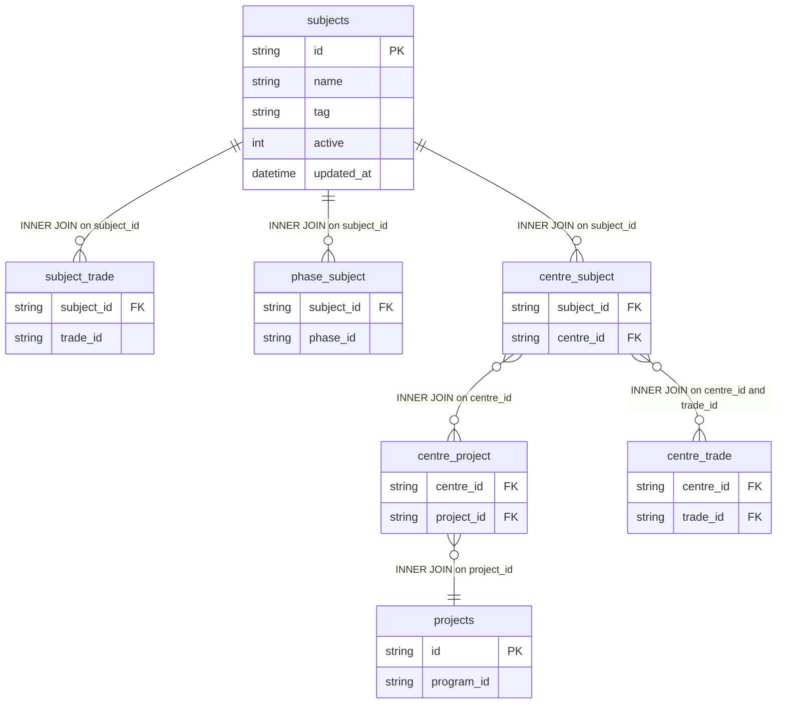

# dim_subject Query Documentation

Source query: `queries/dim_subject.sql`

This query produces one record per subject, aggregating all associated programs, trades, and projects into JSON arrays. The query resolves subject-to-program associations through a multi-path join chain covering trade, phase, centre, and project relationships, then collapses the resulting fan-out using `GROUP BY` and `JSON_ARRAYAGG`. It is intended to populate the DWH dimension `dim_subject`, providing a denormalised subject descriptor for use across fact tables.

## Query Grain

One row per subject (`subject_id`). Multiple join paths (`subject_trade`, `phase_subject`, `centre_subject`, `centre_project`, `centre_trade`) each introduce potential one-to-many relationships, but all are collapsed to one row per subject by the `GROUP BY s.id` and `JSON_ARRAYAGG(DISTINCT ...)` aggregation. No fan-out risk in the final output, though the intermediate join product can be very large.

## Incremental Configuration

| Setting | Value | Reason |
| --- | --- | --- |
| Source table | `quest_rearch_production.subjects` | Subject identity and `updated_at` are driven from the subject record. |
| Source ID column (`id_col`) | `id` | Source primary key used by the pipeline to identify changed records. |
| Destination ID column (`dest_id_col`) | `subject_id` | Output column used by the pipeline to delete and reload changed subject rows. |
| Updated-at column | `updated_at` | Used by the pipeline to detect changed subjects for incremental refresh. |

## Global Filters

No global filters.

## Output Columns

| Output column | Source table | Source column | Transform / logic | Reason for inclusion | Nullable in query |
| --- | --- | --- | --- | --- | --- |
| `subject_id` | `quest_rearch_production.subjects` alias `s` | `id` | Direct select: `s.id AS subject_id` | Primary subject identifier and natural source key for the dimension. | No |
| `subject_name` | `quest_rearch_production.subjects` alias `s` | `name` | Direct select: `s.name AS subject_name` | Human-readable subject name for reporting and filtering. | Depends on source schema |
| `identity_tag` | `quest_rearch_production.subjects` alias `s` | `tag` | Direct select: `s.tag AS identity_tag` | Subject tag used to categorise or identify subjects by type or identity. | Depends on source schema |
| `program_ids` | `quest_rearch_production.projects` alias `p` | `program_id` | `JSON_ARRAYAGG(DISTINCT p.program_id)` — aggregates all distinct program IDs associated with the subject through the centre/project path | Provides the full list of programs the subject is delivered under. | Depends on whether any project rows are found. |
| `trade_ids` | `quest_rearch_production.subject_trade` alias `st` | `trade_id` | `JSON_ARRAYAGG(DISTINCT st.trade_id)` — aggregates all distinct trade IDs for the subject | Captures the trades the subject is mapped to. | Depends on whether any subject_trade rows are found. |
| `project_ids` | `quest_rearch_production.projects` alias `p` | `id` | `JSON_ARRAYAGG(DISTINCT p.id)` — aggregates all distinct project IDs for the subject | Provides the full list of projects the subject is delivered under. | Depends on whether any project rows are found. |
| `active` | `quest_rearch_production.subjects` alias `s` | `active` | Direct select: `s.active AS active` | Indicates whether the subject is currently active. | Depends on source schema |
| `updated_at` | `quest_rearch_production.subjects` alias `s` | `updated_at` | Direct select: `s.updated_at AS updated_at` | Supports auditability and incremental refresh tracking. | Depends on source schema |

## Entity Relationship Diagram

## Join and Cardinality Notes

| Join | Join type | Expected effect |
| --- | --- | --- |
| `subjects` to `subject_trade` | `INNER JOIN` | Excludes subjects with no trade mapping. One subject to many trades — fan-out collapsed by GROUP BY. |
| `subjects` to `phase_subject` | `INNER JOIN` | Excludes subjects not assigned to any phase. One subject to many phases — contributes to intermediate fan-out, collapsed by GROUP BY. |
| `subjects` to `centre_subject` | `INNER JOIN` | Excludes subjects not assigned to any centre. One subject to many centres — contributes to intermediate fan-out, collapsed by GROUP BY. |
| `centre_subject` to `centre_project` | `INNER JOIN` | Resolves projects for each centre the subject is delivered at. |
| `centre_project` to `projects` | `INNER JOIN` | Resolves project records. |
| `centre_subject` to `centre_trade` | `INNER JOIN` with `AND st.trade_id = ct.trade_id` | Filters centre-trade combinations to only those matching the subject's own trade, preventing cross-trade contamination. |

## DWH Interpretation

| Item | Value |
| --- | --- |
| Intended DWH table | `dim_subject` |
| DWH grain risk | Final grain is one row per subject. The intermediate join product can be large due to multiple many-to-many paths, but `GROUP BY` + `JSON_ARRAYAGG(DISTINCT ...)` ensures the output is one row per subject. |
| Production source schema | `quest_rearch_production` |
| DWH source status | The query reads from production source tables, not DWH tables. |
| Output DWH columns | `subject_id`, `subject_name`, `identity_tag`, `program_ids`, `trade_ids`, `project_ids`, `active`, `updated_at` |
