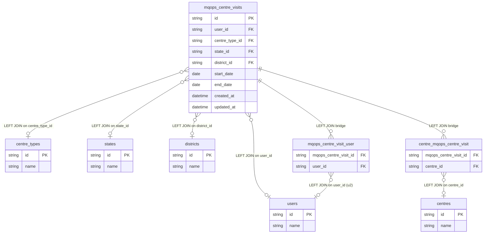

# fact_centre_visit Query Documentation

Source query: `queries/fact_centre_visit.sql`

This query produces records for field centre visits logged in the MQOps system. It joins the core visit record to the visiting user, geography (state, district), centre type, the linked centre(s), and any related users attached to the visit. It is intended to populate the DWH fact table `fact_centre_visit` for monitoring and reporting on field operations.

## Query Grain

Intended grain: one row per centre visit (`centre_visit_id`). However, the query joins two bridge tables — `centre_mqops_centre_visit` (maps a visit to one or more centres) and `mqops_centre_visit_user` (maps a visit to one or more related users). Either join can produce multiple rows per visit if a visit is linked to more than one centre or more than one related user. If both fan out simultaneously, the row count multiplies further.

## Incremental Configuration

| Setting | Value | Reason |
| --- | --- | --- |
| Source table | `quest_rearch_production.mqops_centre_visits` | Visit identity and `updated_at` are driven from the visit record. |
| Source ID column (`id_col`) | `id` | Source primary key used by the pipeline to identify changed records. |
| Destination ID column (`dest_id_col`) | `centre_visit_id` | Output column used by the pipeline to delete and reload changed visit rows. |
| Updated-at column | `updated_at` | Used by the pipeline to detect changed visit records for incremental refresh. |

## Global Filters

No global filters are applied. All rows from `mqops_centre_visits` are included (deleted records are not filtered).

> **Note:** Unlike most other queries, there is no `deleted_at IS NULL` filter on `mqops_centre_visits`. If soft-deleted visits should be excluded, add `WHERE mcv.deleted_at IS NULL`.

## Output Columns

| Output column | Source table | Source column | Transform / logic | Reason for inclusion | Nullable in query |
| --- | --- | --- | --- | --- | --- |
| `centre_visit_id` | `quest_rearch_production.mqops_centre_visits` alias `mcv` | `id` | Direct select: `mcv.id AS centre_visit_id` | Primary grain key for the fact table. | No |
| `user_id` | `quest_rearch_production.mqops_centre_visits` alias `mcv` | `user_id` | Direct select: `mcv.user_id` | Identifies the staff member who conducted the visit. | Depends on source |
| `user_name` | `quest_rearch_production.users` alias `u` | `name` | Resolved via `mqops_centre_visits -> users`: `u.name AS user_name` | Human-readable name of the visiting staff member. | Yes — LEFT joined. |
| `centre_type_id` | `quest_rearch_production.mqops_centre_visits` alias `mcv` | `centre_type_id` | Direct select: `mcv.centre_type_id` | Links to the type of centre visited. | Depends on source |
| `centre_type_name` | `quest_rearch_production.centre_types` alias `ct` | `name` | Resolved via `mqops_centre_visits -> centre_types`: `ct.name AS centre_type_name` | Human-readable centre type label. | Yes — LEFT joined. |
| `state_id` | `quest_rearch_production.mqops_centre_visits` alias `mcv` | `state_id` | Direct select: `mcv.state_id` | Geography dimension key — state. | Depends on source |
| `state_name` | `quest_rearch_production.states` alias `s` | `name` | Resolved via `mqops_centre_visits -> states`: `s.name AS state_name` | Human-readable state name. | Yes — LEFT joined. |
| `district_id` | `quest_rearch_production.mqops_centre_visits` alias `mcv` | `district_id` | Direct select: `mcv.district_id` | Geography dimension key — district. | Depends on source |
| `district_name` | `quest_rearch_production.districts` alias `d` | `name` | Resolved via `mqops_centre_visits -> districts`: `d.name AS district_name` | Human-readable district name. | Yes — LEFT joined. |
| `centre_id` | `quest_rearch_production.centres` alias `c` | `id` | Resolved via bridge table `centre_mqops_centre_visit`: `c.id AS centre_id` | Links the visit to the specific centre visited. Can produce multiple rows if a visit covers more than one centre. | Yes — LEFT joined. |
| `centre_name` | `quest_rearch_production.centres` alias `c` | `name` | Resolved via bridge table: `c.name AS centre_name` | Human-readable centre name. | Yes — LEFT joined. |
| `related_user_id` | `quest_rearch_production.users` alias `u2` | `id` | Resolved via bridge table `mqops_centre_visit_user`: `u2.id AS related_user_id` | Identifies any additional users associated with the visit. Can produce multiple rows. | Yes — LEFT joined. |
| `related_user_name` | `quest_rearch_production.users` alias `u2` | `name` | Resolved via bridge table: `u2.name AS related_user_name` | Human-readable name of the related user. | Yes — LEFT joined. |
| `start_date` | `quest_rearch_production.mqops_centre_visits` alias `mcv` | `start_date` | Direct select: `mcv.start_date` | Visit start date. | Depends on source |
| `end_date` | `quest_rearch_production.mqops_centre_visits` alias `mcv` | `end_date` | Direct select: `mcv.end_date` | Visit end date. | Depends on source |
| `visit_purpose` | `quest_rearch_production.mqops_centre_visits` alias `mcv` | `visit_purpose` | Direct select: `mcv.visit_purpose` | Free-text description of the visit purpose. | Depends on source |
| `infrastructure` … `feedback` | `quest_rearch_production.mqops_centre_visits` alias `mcv` | Various | Direct selects of observation and feedback fields. | Capture structured and free-text field observations. | Depends on source |
| `rating` | `quest_rearch_production.mqops_centre_visits` alias `mcv` | `rating` | Direct select: `mcv.rating` | Overall visit rating. | Depends on source |
| `created_at` | `quest_rearch_production.mqops_centre_visits` alias `mcv` | `created_at` | Direct select: `mcv.created_at` | Timestamp the visit record was created. | Depends on source |
| `updated_at` | `quest_rearch_production.mqops_centre_visits` alias `mcv` | `updated_at` | Direct select: `mcv.updated_at` | Supports auditability and incremental refresh tracking. | Depends on source |

## Entity Relationship Diagram

## Join and Cardinality Notes

| Join | Join type | Expected effect |
| --- | --- | --- |
| `mqops_centre_visits` to `users` (visitor) | `LEFT JOIN` | Resolves visitor name. Visits with no matching user keep a NULL `user_name`. |
| `mqops_centre_visits` to `centre_types` | `LEFT JOIN` | Resolves centre type label. NULL if `centre_type_id` is unset. |
| `mqops_centre_visits` to `states` | `LEFT JOIN` | Resolves state name. NULL if `state_id` is unset. |
| `mqops_centre_visits` to `districts` | `LEFT JOIN` | Resolves district name. NULL if `district_id` is unset. |
| `mqops_centre_visits` to `centre_mqops_centre_visit` | `LEFT JOIN` (bridge) | **Fan-out risk.** If a visit covers multiple centres, one row is produced per centre. |
| `centre_mqops_centre_visit` to `centres` | `LEFT JOIN` | Resolves centre name. NULL if bridge row has no matching centre. |
| `mqops_centre_visits` to `mqops_centre_visit_user` | `LEFT JOIN` (bridge) | **Fan-out risk.** If a visit has multiple related users, one row is produced per user. Combined with the centre fan-out, this multiplies rows. |
| `mqops_centre_visit_user` to `users` (related) | `LEFT JOIN` | Resolves related user name. |

## DWH Interpretation

| Item | Value |
| --- | --- |
| Intended DWH table | `fact_centre_visit` |
| DWH grain risk | **High fan-out risk.** Joining both `centre_mqops_centre_visit` and `mqops_centre_visit_user` bridge tables can multiply rows per visit. If a strict one-row-per-visit grain is needed, aggregate centre names and related user names using `GROUP_CONCAT` before loading. |
| Production source schema | `quest_rearch_production` |
| DWH source status | The query reads from production source tables, not DWH tables. |
| Output DWH columns | `centre_visit_id`, `user_id`, `user_name`, `centre_type_id`, `centre_type_name`, `state_id`, `state_name`, `district_id`, `district_name`, `centre_id`, `centre_name`, `related_user_id`, `related_user_name`, `start_date`, `end_date`, `visit_purpose`, `infrastructure`, `infrastructure_issues`, `good_practice`, `publicity_material`, `placement_issue`, `quest_content`, `immediate_action`, `student_data`, `meet_authority`, `trainer_issues`, `mobilization_issues`, `digital_lesson`, `attendance_issues`, `feedback`, `rating`, `created_at`, `updated_at` |
