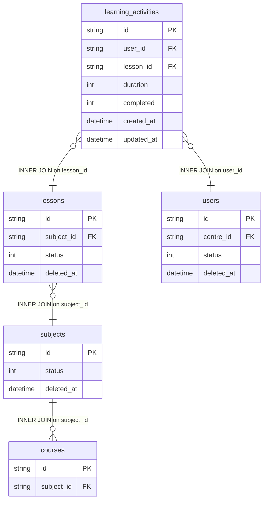

# fact_learning_event Query Documentation

Source query: `queries/fact_learning_event.sql`

This query produces records for completed learning activity events, joining each activity to its lesson, subject, course, and the learner's centre. It is intended to populate the DWH fact table `fact_learning_event`, capturing the engagement and duration of individual completed learning interactions for analysis across learner, centre, subject, and course dimensions.

## Query Grain

Intended grain: one row per `learning_activity_id` (individual completed learning activity). However, the query includes `SUM(la.duration) AS total_duration_secs` without a `GROUP BY` clause. In standard SQL, using an aggregate function without GROUP BY collapses all selected rows into a single row, meaning the query as written would return one row for the entire filtered dataset rather than one row per activity. This is almost certainly a bug — the likely intent is to aggregate duration per activity or per learner/lesson combination. This must be corrected before production use.

## Incremental Configuration

| Setting | Value | Reason |
| --- | --- | --- |
| Source table | `quest_rearch_production.learning_activities` | Learning activity identity and `updated_at` are driven from the activity record. |
| Source ID column (`id_col`) | `id` | Source primary key used by the pipeline to identify changed records. |
| Destination ID column (`dest_id_col`) | `learning_activity_id` | Output column used by the pipeline to delete and reload changed activity rows. |
| Updated-at column | `updated_at` | Used by the pipeline to detect changed activities for incremental refresh. |

## Global Filters

| Filter | Reason |
| --- | --- |
| `u.deleted_at IS NULL` | Excludes learning activities belonging to soft-deleted users. |
| `u.status = 1` | Includes only activities for active users. |
| `la.completed = 1` | Restricts to completed learning activities only. |
| `s.status = 1` | Includes only activities for active subjects. |
| `l.status = 1` | Includes only activities for active lessons. |
| `l.deleted_at IS NULL` | Excludes activities for soft-deleted lessons. |
| `s.deleted_at IS NULL` | Excludes activities for soft-deleted subjects. |
| `la.created_at >= '2026-05-01'` | Restricts to activities created on or after 2026-05-01. This is a hardcoded date filter that may need to be parameterised or removed for a full historical load. |

## Output Columns

| Output column | Source table | Source column | Transform / logic | Reason for inclusion | Nullable in query |
| --- | --- | --- | --- | --- | --- |
| `learning_activity_id` | `quest_rearch_production.learning_activities` alias `la` | `id` | Direct select: `la.id AS learning_activity_id` | Primary fact grain key identifying the learning activity event. | No |
| `user_id` | `quest_rearch_production.learning_activities` alias `la` | `user_id` | Direct select: `la.user_id` | Links the event to the learner dimension. | Depends on source schema |
| `subject_id` | `quest_rearch_production.lessons` alias `l` | `subject_id` | Resolved via `learning_activities -> lessons`: `l.subject_id AS subject_id` | Links the event to the subject dimension. | No — `lessons` is INNER joined. |
| `course_id` | `quest_rearch_production.courses` alias `c` | `id` | Resolved via `subjects -> courses`: `c.id AS course_id` | Links the event to the course. | No — `courses` is INNER joined. |
| `lesson_id` | `quest_rearch_production.lessons` alias `l` | `id` | Direct select: `l.id AS lesson_id` | Links the event to the specific lesson consumed. | No — `lessons` is INNER joined. |
| `centre_id` | `quest_rearch_production.users` alias `u` | `centre_id` | Resolved via `learning_activities -> users`: `u.centre_id AS centre_id` | Links the event to the learner's centre for centre-level analysis. | Depends on source schema |
| `total_duration_secs` | `quest_rearch_production.learning_activities` alias `la` | `duration` | `SUM(la.duration) AS total_duration_secs` — aggregate without GROUP BY. **Bug: without GROUP BY this collapses all rows to one.** | Intended to capture total engagement duration for the activity. Must add GROUP BY to produce per-activity totals. | No (always returns a value due to SUM) |
| `updated_at` | `quest_rearch_production.learning_activities` alias `la` | `updated_at` | Direct select: `la.updated_at AS updated_at` | Supports auditability and incremental refresh tracking. | Depends on source schema |

## Entity Relationship Diagram

## Join and Cardinality Notes

| Join | Join type | Expected effect |
| --- | --- | --- |
| `learning_activities` to `lessons` | `INNER JOIN` | Excludes activities with no matching lesson. |
| `lessons` to `subjects` | `INNER JOIN` | Excludes activities for lessons with no subject. |
| `subjects` to `courses` | `INNER JOIN` | Resolves the course for the subject. Could fan-out if a subject maps to multiple courses. |
| `learning_activities` to `users` | `INNER JOIN` | Resolves centre_id from the learner record. Excludes activities for non-existent users. |

## DWH Interpretation

| Item | Value |
| --- | --- |
| Intended DWH table | `fact_learning_event` |
| DWH grain risk | **Critical bug:** `SUM(la.duration)` without `GROUP BY` collapses the entire result to one row. Add `GROUP BY la.id, la.user_id, l.subject_id, c.id, l.id, u.centre_id, la.updated_at` to restore per-activity grain. Additionally, the `courses` join may introduce fan-out if a subject maps to multiple courses. |
| Production source schema | `quest_rearch_production` |
| DWH source status | The query reads from production source tables, not DWH tables. |
| Output DWH columns | `learning_activity_id`, `user_id`, `subject_id`, `course_id`, `lesson_id`, `centre_id`, `total_duration_secs`, `updated_at` |
