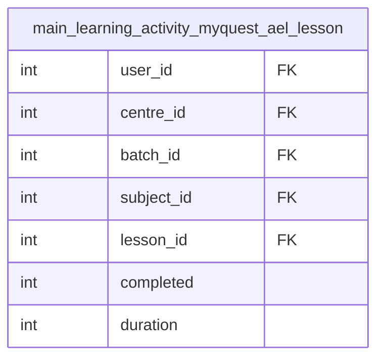

# fact_lesson_progress Query Documentation

Source query: `queries/fact_lesson_progress.sql`

This query produces per-learner, per-lesson progress records from the pre-aggregated `main_learning_activity_myquest_ael_lesson` table in the analytics destination database. It captures completion status and time spent for each lesson a learner has engaged with, supporting lesson-level analysis across learner, subject, batch, and centre dimensions.

## Query Grain

One row per learner-lesson combination (`user_id`, `lesson_id`). No aggregation is applied — the query assumes the source table `main_learning_activity_myquest_ael_lesson` already holds one pre-aggregated row per learner-lesson pair.

## Incremental Configuration

This query uses `-- @dest_only` and reads from the analytics destination database (`quest_ple_analytics`), not the production source. Incremental mode is not configured. The pipeline runs a full replace on each execution.

## Global Filters

No global filters are applied. All rows from `main_learning_activity_myquest_ael_lesson` are included.

## Output Columns

| Output column | Source table | Source column | Transform / logic | Reason for inclusion | Nullable in query |
| --- | --- | --- | --- | --- | --- |
| `user_id` | `quest_analytics.main_learning_activity_myquest_ael_lesson` alias `m` | `user_id` | Direct select: `m.user_id` | Identifies the learner. Links to the learner dimension. | Depends on source |
| `centre_id` | `quest_analytics.main_learning_activity_myquest_ael_lesson` alias `m` | `centre_id` | Direct select: `m.centre_id` | Links the record to the learner's centre for centre-level analysis. | Depends on source |
| `batch_id` | `quest_analytics.main_learning_activity_myquest_ael_lesson` alias `m` | `batch_id` | Direct select: `m.batch_id` | Links the record to the learner's batch. | Depends on source |
| `subject_id` | `quest_analytics.main_learning_activity_myquest_ael_lesson` alias `m` | `subject_id` | Direct select: `m.subject_id` | Links the record to the subject dimension. | Depends on source |
| `lesson_id` | `quest_analytics.main_learning_activity_myquest_ael_lesson` alias `m` | `lesson_id` | Direct select: `m.lesson_id` | Identifies the specific lesson. Forms part of the fact grain. | Depends on source |
| `completed` | `quest_analytics.main_learning_activity_myquest_ael_lesson` alias `m` | `completed` | Direct select: `m.completed` | Boolean/integer flag indicating whether the lesson was completed. | Depends on source |
| `time_spent_secs` | `quest_analytics.main_learning_activity_myquest_ael_lesson` alias `m` | `duration` | `m.duration AS time_spent_secs` | Total time the learner spent on this lesson, in seconds. | Depends on source |

## Entity Relationship Diagram

This query reads from a single pre-aggregated table — no joins are performed.

## Join and Cardinality Notes

No joins. The query selects directly from the pre-aggregated `main_learning_activity_myquest_ael_lesson` table, which is assumed to already hold one row per learner-lesson combination.

## DWH Interpretation

| Item | Value |
| --- | --- |
| Intended DWH table | `fact_lesson_progress` |
| DWH grain risk | Grain depends on the upstream `main_learning_activity_myquest_ael_lesson` table. If that table contains duplicate `(user_id, lesson_id)` rows, this fact table will also contain duplicates. |
| Source schema | `quest_ple_analytics` (destination / analytics DB) |
| DWH source status | Reads from a pre-aggregated analytics table, not directly from the production source. The `@dest_only` flag is set — the pipeline connects to the destination DB for this query. |
| Output DWH columns | `user_id`, `centre_id`, `batch_id`, `subject_id`, `lesson_id`, `completed`, `time_spent_secs` |
