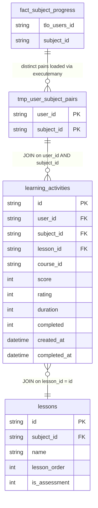

# fact_lesson_progress Documentation

Source: `python_query/fact_lesson_progress.py` (**not** a `queries/*.sql` file)

> **This is a standalone Python script, not part of the automated `main.py` pipeline.** `main.py` only scans `.sql` files in `queries/`, so this script must be run separately (e.g. `python python_query/fact_lesson_progress.py`, or chained after the main run: `python main.py --full-refresh && python python_query/fact_lesson_progress.py`). See the README's "Cross-Database Python Scripts" section for why this couldn't be a plain SQL query.

## Why this is a Python script, not a query file

`fact_lesson_progress` needs data that lives on two separate database servers, each reachable only through its own SSH tunnel:

1. **Destination DB** (`myquest_data_model.fact_subject_progress`) — the `(tlo_users_id, subject_id)` pairs we already track subject-level progress for.
2. **Source DB** (`quest_rearch_production.learning_activities` + `lessons`) — the completed lesson-level activity for exactly those pairs.

No single SQL connection can `JOIN` across both servers, so the script pulls the pairs from the destination first, then drives the source-side query with them.

## Grain

One row per completed learning activity (`activity_id`) for a learner-subject pair known to `fact_subject_progress`. This is **not** deduplicated to one row per `(user_id, lesson_id)` — a learner with multiple completed activity records for the same lesson (e.g. retries) produces multiple output rows.

## How it works

1. `_fetch_pairs()` — queries the destination DB for `SELECT tlo_users_id AS user_id, subject_id FROM fact_subject_progress GROUP BY tlo_users_id, subject_id`, returning the distinct set of pairs (~820,000 as of the last run).
2. `_load_pairs_into_temp_table()` — opens one connection to the source DB, creates a `TEMPORARY TABLE tmp_user_subject_pairs (user_id, subject_id)`, and bulk-inserts all pairs via batched `INSERT IGNORE ... executemany()` (5,000 rows per batch). Temporary tables are connection-scoped, so the same connection is reused for the query in step 3.
3. The main `JOIN_SQL` query runs against that temp table, joined to `learning_activities` and `lessons`, filtered to `completed = 1`, and streamed back via an `SSCursor` in `QUERY_FETCH_CHUNK_SIZE`-row batches.
4. Each batch is written to the destination `fact_lesson_progress` table using `_write_with_conn` — the first batch does `if_exists="replace"`, subsequent batches `"append"` — using a single persistent destination connection for the whole run (same pattern `main.py` uses to avoid bastion rate-limiting from opening a new SSH tunnel per chunk).

## Filter join, not `SELECT *`

`learning_activities` and `lessons` both have columns named `id`, `subject_id`, `created_at`, and `updated_at`. A literal `SELECT *` across the join would produce duplicate DataFrame/table column names, so the script selects explicit, aliased columns instead. The filter itself uses `la.subject_id = p.subject_id` directly — `learning_activities` already carries `subject_id`, so the `lessons` join is only needed for lesson-level enrichment (name, order, assessment flag), not for the subject filter.

## Output Columns

| Output column | Source table | Source column | Transform / logic | Reason for inclusion | Nullable |
| --- | --- | --- | --- | --- | --- |
| `activity_id` | `quest_rearch_production.learning_activities` alias `la` | `id` | Direct select: `la.id AS activity_id` | Identifies the specific activity record. | No |
| `user_id` | `learning_activities` alias `la` | `user_id` | Direct select | Identifies the learner. | No |
| `centre_id` | `learning_activities` alias `la` | `centre_id` | Direct select | Links the record to the learner's centre. | Depends on source |
| `subject_id` | `learning_activities` alias `la` | `subject_id` | Direct select; also drives the temp-table join filter | Links the record to the subject dimension. | Depends on source |
| `lesson_id` | `learning_activities` alias `la` | `lesson_id` | Direct select | Identifies the specific lesson. | Depends on source |
| `course_id` | `learning_activities` alias `la` | `course_id` | Direct select | Links the record to the course dimension. | Depends on source |
| `lesson_name` | `quest_rearch_production.lessons` alias `l` | `name` | `l.name AS lesson_name` | Human-readable lesson name. | Depends on source |
| `lesson_order` | `lessons` alias `l` | `lesson_order` | Direct select | Ordering of the lesson within its subject. | Depends on source |
| `is_assessment` | `lessons` alias `l` | `is_assessment` | Direct select | Flags assessment-type lessons. | Depends on source |
| `score` | `learning_activities` alias `la` | `score` | Direct select | Activity score. | Depends on source |
| `rating` | `learning_activities` alias `la` | `rating` | Direct select | Learner-provided rating for the activity. | Depends on source |
| `duration` | `learning_activities` alias `la` | `duration` | Direct select | Time spent on the activity, in seconds. | Depends on source |
| `created_at` | `learning_activities` alias `la` | `created_at` | Direct select | When the activity record was created. | Depends on source |
| `completed` | `learning_activities` alias `la` | `completed` | Direct select | Completion flag — filtered to `1` by the `WHERE` clause, so always `1` in the output. | No |
| `completed_at` | `learning_activities` alias `la` | `completed_at` | Direct select | When the activity was marked complete. | Depends on source |

## Entity Relationship Diagram

## DWH Interpretation

| Item | Value |
| --- | --- |
| Intended DWH table | `fact_lesson_progress` |
| DWH grain risk | One row per completed activity, not per learner-lesson. If the intended grain is one row per `(user_id, lesson_id)`, add a dedup/aggregation step (e.g. keep the latest `completed_at`, or `SUM(duration)` across attempts) before writing. |
| Source schema | Cross-database: pairs from `myquest_data_model` (destination), activity/lesson data from `quest_rearch_production` (source) |
| DWH source status | Not expressible as a single `-- @dest_only` or `-- @incremental` query file — requires the Python temp-table bridging pattern described above. Runs as a full replace on every execution; there is no incremental mode. |
| Output DWH columns | `activity_id`, `user_id`, `centre_id`, `subject_id`, `lesson_id`, `course_id`, `lesson_name`, `lesson_order`, `is_assessment`, `score`, `rating`, `duration`, `created_at`, `completed`, `completed_at` |
