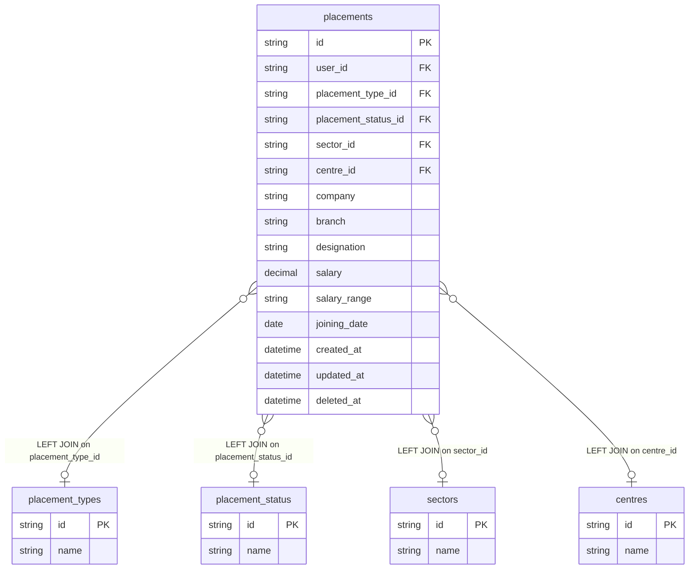

# fact_placement Query Documentation

Source query: `queries/fact_placement.sql`

This query produces placement records for learners across three distinct placement types, using a `UNION ALL` of three identical SELECT branches — each filtered to a specific `placement_type_id` UUID. Within each branch, records are grouped by `user_id` and ordered by `created_at DESC` to surface the most recent placement per learner per type. The result is wrapped in an outer `SELECT *` and aliased as `combined_data`. It is intended to populate the DWH fact table `fact_placement`, supporting placement outcome analysis across learner, centre, project, and placement type dimensions.

## Query Grain

Intended grain: one row per learner (`pl_user_id`) per placement type, representing their most recent non-deleted placement of that type. The three `UNION ALL` branches cover three specific placement type UUIDs, so a learner can appear up to three times in the final result — once per placement type branch.

> **Important — GROUP BY behaviour in MySQL:** Each branch uses `GROUP BY placements.user_id` with `ORDER BY placements.created_at DESC`. In MySQL with `ONLY_FULL_GROUP_BY` disabled, this returns an arbitrary row per `user_id` rather than guaranteed the most-recent row. If the server has `ONLY_FULL_GROUP_BY` enabled, the query will fail. To reliably select the latest placement per learner, consider replacing the `GROUP BY` + `ORDER BY` pattern with a window function or a correlated subquery (`WHERE p.id = (SELECT id FROM placements WHERE user_id = p.user_id AND placement_type_id = '...' AND deleted_at IS NULL ORDER BY created_at DESC LIMIT 1)`).

## Incremental Configuration

| Setting | Value | Reason |
| --- | --- | --- |
| Source table | `quest_rearch_production.placements` | Placement identity and `updated_at` are driven from the placement record. |
| Source ID column (`id_col`) | `id` | Source primary key used by the pipeline to identify changed records. |
| Destination ID column (`dest_id_col`) | `placement_id` | Output column used by the pipeline to delete and reload changed placement rows. |
| Updated-at column | `updated_at` | Used by the pipeline to detect changed placement records for incremental refresh. |

## Global Filters

The following filters are applied identically in all three `UNION ALL` branches:

| Filter | Reason |
| --- | --- |
| `placements.deleted_at IS NULL` | Excludes soft-deleted placement records from all branches. |
| `placements.placement_type_id IN ('<uuid>')` | Each branch restricts to a single placement type UUID. This is the key differentiator between the three branches. |

### Placement Type UUIDs

| Branch | UUID | Likely placement type |
| --- | --- | --- |
| Branch 1 | `1627ed64-074f-4f92-9b6c-c7fb6aa0bc2c` | TBD — confirm against `placement_types` table |
| Branch 2 | `e76fb44d-dfa9-45f7-a836-e868685f863e` | TBD — confirm against `placement_types` table |
| Branch 3 | `aeb3bd2a-e311-4758-ac4f-2fd4334b03c0` | TBD — confirm against `placement_types` table |

> These UUIDs are hardcoded. If new placement types are added to the source, a new `UNION ALL` branch must be added manually.

## Output Columns

All three branches produce the same column set. The outer `SELECT *` passes them through unchanged.

| Output column | Source table | Source column | Transform / logic | Reason for inclusion | Nullable in query |
| --- | --- | --- | --- | --- | --- |
| `pl_user_id` | `quest_rearch_production.placements` | `user_id` | Direct select: `placements.user_id AS pl_user_id` | Identifies the learner. Links to the learner dimension. Forms the grain key within each branch. | Depends on source schema |
| `placement_id` | `quest_rearch_production.placements` | `id` | Direct select: `placements.id AS placement_id` | Primary placement record identifier. Used by the pipeline as the `dest_id_col` for incremental delete-and-reload. | No |
| `pl_deleted_at` | `quest_rearch_production.placements` | `deleted_at` | Direct select: `placements.deleted_at AS pl_deleted_at` | Carried through for auditability. Should always be NULL given the `WHERE deleted_at IS NULL` filter. | Yes — always NULL due to filter. |
| `sector` | `quest_rearch_production.sectors` | `name` | Resolved via `placements -> sectors`: `sectors.name AS sector` | Human-readable industry sector name for the placement. | Yes — LEFT joined; NULL if `sector_id` is unset or unmatched. |
| `pl_placement_status` | `quest_rearch_production.placement_status` | `name` | Resolved via `placements -> placement_status`: `placement_status.name AS pl_placement_status` | Human-readable placement status label (e.g. Placed, Offer Letter). | Yes — LEFT joined; NULL if `placement_status_id` is unset. |
| `company` | `quest_rearch_production.placements` | `company` | Direct select: `placements.company AS company` | Name of the company where the learner was placed. | Depends on source schema |
| `branch` | `quest_rearch_production.placements` | `branch` | Direct select: `placements.branch AS branch` | Branch or location of the placement company. | Depends on source schema |
| `designation` | `quest_rearch_production.placements` | `designation` | Direct select: `placements.designation AS designation` | Job title or role of the placement. | Depends on source schema |
| `sector_id` | `quest_rearch_production.placements` | `sector_id` | Direct select: `placements.sector_id AS sector_id` | Foreign key to the sectors dimension. Retained alongside `sector` name for joins. | Depends on source schema |
| `salary` | `quest_rearch_production.placements` | `salary` | Direct select: `placements.salary AS salary` | Absolute salary value for the placement. | Depends on source schema |
| `salary_range` | `quest_rearch_production.placements` | `salary_range` | Direct select: `placements.salary_range AS salary_range` | Banded salary range category for the placement. | Depends on source schema |
| `joining_date` | `quest_rearch_production.placements` | `joining_date` | Direct select: `placements.joining_date AS joining_date` | Date the learner joined the employer. Supports time-to-placement analysis. | Depends on source schema |
| `pl_updated_at` | `quest_rearch_production.placements` | `updated_at` | Direct select: `placements.updated_at AS pl_updated_at` | Supports auditability and incremental refresh tracking. | Depends on source schema |
| `pl_created_at` | `quest_rearch_production.placements` | `created_at` | Direct select: `placements.created_at AS pl_created_at` | Timestamp the placement record was created. Used for ordering within the GROUP BY. | Depends on source schema |
| `pl_type` | `quest_rearch_production.placements` | `placement_type_id` | Direct select: `placements.placement_type_id AS pl_type` | UUID foreign key to `placement_types`. Retained alongside `pl_type_name`. | Depends on source schema |
| `pl_type_name` | `quest_rearch_production.placement_types` | `name` | Resolved via `placements -> placement_types`: `placement_types.name AS pl_type_name` | Human-readable placement type label. | Yes — LEFT joined; NULL if `placement_type_id` is unmatched. |
| `pl_status_id` | `quest_rearch_production.placement_status` | `id` | Direct select: `placement_status.id AS pl_status_id` | Foreign key for the placement status. Retained alongside the name for dimension joins. | Yes — LEFT joined. |
| `placement_status` | `quest_rearch_production.placement_status` | `name` | Direct select: `placement_status.name AS placement_status` | Duplicate of `pl_placement_status` — both columns select `placement_status.name`. Consider removing one. | Yes — LEFT joined. |

> **Note:** `pl_placement_status` and `placement_status` are both aliases for `placement_status.name` from the same join. This is a duplicate column. Consider removing `placement_status` (the un-prefixed alias) to avoid confusion downstream.

## Entity Relationship Diagram

> **Note:** `centres` is joined in the FROM clause but no columns from `centres` are selected in any branch. The join is unused in the current query output.

## Join and Cardinality Notes

| Join | Join type | Expected effect |
| --- | --- | --- |
| `placements` to `placement_types` | `LEFT JOIN` | Resolves placement type name. NULL if `placement_type_id` has no matching record (unlikely given the UUID filter). |
| `placements` to `placement_status` | `LEFT JOIN` | Resolves status name and ID. NULL if `placement_status_id` is unset. |
| `placements` to `sectors` | `LEFT JOIN` | Resolves sector name. NULL if `sector_id` is unset or has no matching record. |
| `placements` to `centres` | `LEFT JOIN` | Joined but **no columns are selected from `centres`** in any branch. The join is effectively unused and can be removed without changing query output. |

## UNION ALL Structure

The query runs three identical branches, each filtering to a different `placement_type_id` UUID, then unions the results with `UNION ALL` (duplicates across branches are retained). This pattern means:
- A learner can appear in more than one branch if they have placements of multiple types.
- Within each branch, `GROUP BY user_id` reduces to one row per learner per type.
- `UNION ALL` is used rather than `UNION DISTINCT`, so if somehow the same row appeared in two branches it would be duplicated — this should not occur given the exclusive `placement_type_id` filter per branch.

## DWH Interpretation

| Item | Value |
| --- | --- |
| Intended DWH table | `fact_placement` |
| DWH grain risk | **Medium.** The `GROUP BY user_id` within each branch relies on MySQL's non-deterministic GROUP BY behaviour to select the latest row. This is not guaranteed without a window function or subquery. A learner may appear up to three times (once per placement type). If exactly one row per learner is needed, further deduplication is required after loading. |
| Production source schema | `quest_rearch_production` |
| DWH source status | The query reads from production source tables, not DWH tables. |
| Known issues | (1) `pl_placement_status` and `placement_status` are duplicate columns — both select `placement_status.name`. (2) `centres` is joined but no centre columns are selected. (3) Hardcoded placement type UUIDs require manual maintenance when new types are added. |
| Output DWH columns | `pl_user_id`, `placement_id`, `pl_deleted_at`, `sector`, `pl_placement_status`, `company`, `branch`, `designation`, `sector_id`, `salary`, `salary_range`, `joining_date`, `pl_updated_at`, `pl_created_at`, `pl_type`, `pl_type_name`, `pl_status_id`, `placement_status` |
