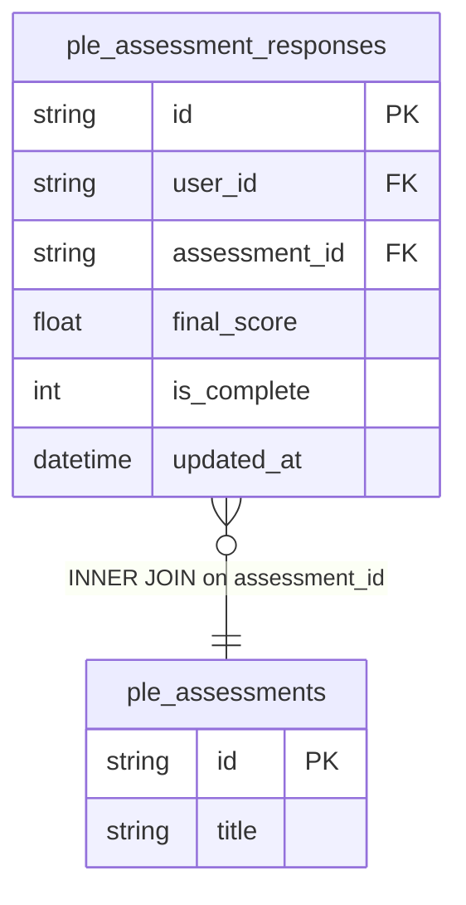

# fact_ple_response Query Documentation

Source query: `queries/fact_ple_response.sql`

This query produces records of PLE (Pre/Post Learner Evaluation) assessment responses, joining each response to its assessment metadata to derive the assessment type and career path from the assessment title. It is intended to populate the DWH fact table `fact_ple_response`, capturing individual learner assessment outcomes for PLE analysis.

> **Production readiness warning:** The query currently contains a hardcoded `WHERE par.user_id IN ('0002b451-65cc-44c8-886e-b5546ec553ec')` filter that restricts output to a single user. This is a development/debugging filter and **must be removed before this query is used for a production load.** As written, the query will only ever load data for one learner.

## Query Grain

One row per PLE assessment response (`response_id`). Each response corresponds to one learner's completion attempt for one assessment. No joins introduce fan-out — `ple_assessments` is joined one-to-one per response via `assessment_id`.

## Incremental Configuration

| Setting | Value | Reason |
| --- | --- | --- |
| Source table | `quest_rearch_production.ple_assessment_responses` | Response identity and `updated_at` are driven from the response record. |
| Source ID column (`id_col`) | `id` | Source primary key used by the pipeline to identify changed records. |
| Destination ID column (`dest_id_col`) | `response_id` | Output column used by the pipeline to delete and reload changed response rows. |
| Updated-at column | `updated_at` | Used by the pipeline to detect changed responses for incremental refresh. |

## Global Filters

| Filter | Reason |
| --- | --- |
| `par.user_id IN ('0002b451-65cc-44c8-886e-b5546ec553ec')` | **Development filter — hardcodes a single user UUID. Must be removed for production use.** This restricts the query output to a single learner and will prevent any other learner's data from being loaded. |

## Output Columns

| Output column | Source table | Source column | Transform / logic | Reason for inclusion | Nullable in query |
| --- | --- | --- | --- | --- | --- |
| `response_id` | `quest_rearch_production.ple_assessment_responses` alias `par` | `id` | Direct select: `par.id AS response_id` | Primary fact grain key identifying the assessment response record. | No |
| `user_id` | `quest_rearch_production.ple_assessment_responses` alias `par` | `user_id` | Direct select: `par.user_id` | Links the response to the learner. | Depends on source schema |
| `assessment_type` | `quest_rearch_production.ple_assessments` alias `pa` | `title` | `SUBSTRING_INDEX(pa.title, ' - ', 1)` — extracts everything before the first ` - ` delimiter in the title | Derives the assessment type (e.g. Pre, Post) from the title string. Returns the full title if the delimiter is absent. | No — `ple_assessments` is INNER joined. |
| `assessment_careerpath` | `quest_rearch_production.ple_assessments` alias `pa` | `title` | `SUBSTRING_INDEX(pa.title, ' - ', -1)` — extracts everything after the last ` - ` delimiter in the title | Derives the career path name from the assessment title. Returns the full title if the delimiter is absent. | No — `ple_assessments` is INNER joined. |
| `assessment_id` | `quest_rearch_production.ple_assessment_responses` alias `par` | `assessment_id` | Direct select: `par.assessment_id` | Foreign key linking the response to its assessment definition. | Depends on source schema |
| `score` | `quest_rearch_production.ple_assessment_responses` alias `par` | `final_score` | Direct select: `par.final_score AS score` | The learner's final score for the assessment response. | Depends on source schema |
| `completed_at` | `quest_rearch_production.ple_assessment_responses` alias `par` | `updated_at` | `CASE WHEN par.is_complete = 1 THEN par.updated_at ELSE NULL END AS completed_at` | Records the completion timestamp only when the assessment is marked complete. Returns NULL for incomplete responses. | Yes — NULL when `is_complete != 1`. |
| `updated_at` | `quest_rearch_production.ple_assessment_responses` alias `par` | `updated_at` | Direct select: `par.updated_at` | Supports auditability and incremental refresh tracking. | Depends on source schema |

## Entity Relationship Diagram

## Join and Cardinality Notes

| Join | Join type | Expected effect |
| --- | --- | --- |
| `ple_assessment_responses` to `ple_assessments` | `INNER JOIN` | Excludes responses with no matching assessment definition. Expected one-to-one per response; no fan-out. |

## DWH Interpretation

| Item | Value |
| --- | --- |
| Intended DWH table | `fact_ple_response` |
| DWH grain risk | No structural fan-out risk. However, the hardcoded user filter means the table will only contain data for one learner until the filter is removed. |
| Production source schema | `quest_rearch_production` |
| DWH source status | The query reads from production source tables, not DWH tables. |
| Output DWH columns | `response_id`, `user_id`, `assessment_type`, `assessment_careerpath`, `assessment_id`, `score`, `completed_at`, `updated_at` |
