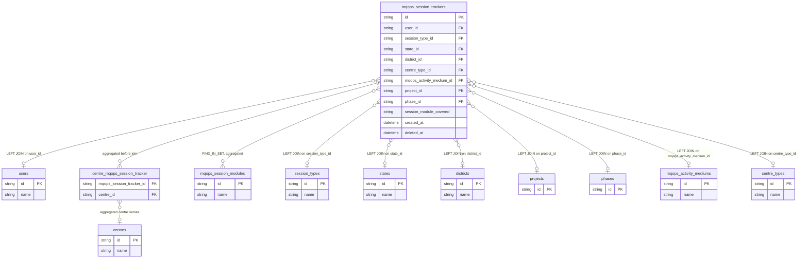

# fact_session Query Documentation

Source query: `queries/fact_session.sql`

This query produces MQOps session tracker records enriched with user, session type, geography, centre type, activity medium, linked centre names, and resolved session module names. It is intended to populate the DWH fact table `fact_session`, providing session-level operational reporting across facilitators, locations, session types, and participant counts.

## Query Grain

One row per session tracker record (`id`). The query preserves this grain by aggregating linked centres and session modules in derived tables before joining them back to `mqops_session_trackers`.

## Incremental Configuration

| Setting | Value | Reason |
| --- | --- | --- |
| Source table | `quest_rearch_production.mqops_session_trackers` | Session tracker identity is driven from the session record. |
| Source ID column (`id_col`) | `id` | Source primary key used by the pipeline to identify changed records. |
| Destination ID column (`dest_id_col`) | `id` | Output column used by the pipeline to delete and reload changed session rows. |
| Updated-at column | `created_at` | Used by the pipeline to detect records for incremental refresh. Note that this tracks newly created rows, not later edits. |

## Global Filters

| Filter | Reason |
| --- | --- |
| `sess.deleted_at IS NULL` | Excludes soft-deleted session tracker records. |
| `sess.deleted_at IS NULL` inside `pre` | Excludes soft-deleted sessions while aggregating linked centre names. |
| `sess.deleted_at IS NULL` inside `modagg` | Excludes soft-deleted sessions while resolving session module names. |

## Output Columns

| Output column | Source table | Source column | Transform / logic | Reason for inclusion | Nullable in query |
| --- | --- | --- | --- | --- | --- |
| `id` | `quest_rearch_production.mqops_session_trackers` alias `sess` | `id` | Direct select: `sess.id AS id` | Primary fact grain key for the session tracker record. | No |
| `user_name` | `quest_rearch_production.users` alias `u` | `name` | Resolved via LEFT JOIN on `sess.user_id = u.id` | Identifies the user who logged or owns the session. | Yes — `users` is LEFT joined. |
| `created_at` | `quest_rearch_production.mqops_session_trackers` alias `sess` | `created_at` | Direct select | Record creation timestamp and incremental tracking field. | Depends on source schema |
| `session_type_name` | `quest_rearch_production.session_types` alias `st` | `name` | Resolved via LEFT JOIN on `sess.session_type_id = st.id` | Human-readable session type for reporting. | Yes — `session_types` is LEFT joined. |
| `state_name` | `quest_rearch_production.states` alias `s` | `name` | Resolved via LEFT JOIN on `sess.state_id = s.id` | Human-readable state name. | Yes — `states` is LEFT joined. |
| `district_name` | `quest_rearch_production.districts` alias `d` | `name` | Resolved via LEFT JOIN on `sess.district_id = d.id` | Human-readable district name. | Yes — `districts` is LEFT joined. |
| `centre_type_name` | `quest_rearch_production.centre_types` alias `ct` | `name` | Resolved via LEFT JOIN on `sess.centre_type_id = ct.id` | Human-readable centre type label. | Yes — `centre_types` is LEFT joined. |
| `session_medium` | `quest_rearch_production.mqops_activity_mediums` alias `mm` | `name` | Resolved via LEFT JOIN on `sess.mqops_activity_medium_id = mm.id` | Indicates session delivery or activity medium. | Yes — `mqops_activity_mediums` is LEFT joined. |
| `centres` | Derived table `pre` | `centres.name` | `GROUP_CONCAT(DISTINCT cen.name SEPARATOR ',')` grouped by session ID | Lists all centres linked to the session without multiplying rows. | Yes — derived table is LEFT joined. |
| `session_modules` | Derived table `modagg` | `mqops_session_modules.name` | `GROUP_CONCAT(DISTINCT m.name SEPARATOR ', ')` after `FIND_IN_SET` against `sess.session_module_covered` | Resolves comma-separated module IDs into readable module names. | Yes — derived table is LEFT joined. |
| `start_date` | `mqops_session_trackers` alias `sess` | `start_date` | Direct select | Session start date. | Depends on source schema |
| `end_date` | `mqops_session_trackers` alias `sess` | `end_date` | Direct select | Session end date. | Depends on source schema |
| `duration` | `mqops_session_trackers` alias `sess` | `duration` | Direct select | Session duration for time-based analysis. | Depends on source schema |
| `ext_person_name`, `company_name`, `guest_type_id`, `volunteer_count` | `mqops_session_trackers` alias `sess` | Same-named columns | Direct selects | Capture external speaker, company, guest, and volunteer session attributes. | Depends on source schema |
| `participant_count`, `male_participant_count`, `female_participant_count`, `other_participant_count` | `mqops_session_trackers` alias `sess` | Same-named columns | Direct selects | Participant counts by gender category. | Depends on source schema |
| `district_id` | `mqops_session_trackers` alias `sess` | `district_id` | Direct select | Geography key for downstream joins where the name is not sufficient. | Depends on source schema |
| Session detail and feedback fields | `mqops_session_trackers` alias `sess` | `session_details`, `topics_covered`, `key_highlights`, `feedback_*`, and related form-response columns | Direct selects | Preserve structured and free-text operational form responses from the source tracker. | Depends on source schema |
| Green skills, learner journey, career pathway, baseline/endline, and volunteer fields | `mqops_session_trackers` alias `sess` | Same-named columns | Direct selects | Capture program-specific session observations and metrics. | Depends on source schema |
| `form_pdf` | `mqops_session_trackers` alias `sess` | `form_pdf` | Direct select | Stores the source form PDF reference, when present. | Depends on source schema |

## Entity Relationship Diagram

## Join and Cardinality Notes

| Join | Join type | Expected effect |
| --- | --- | --- |
| `mqops_session_trackers` to `users` | `LEFT JOIN` | Preserves sessions even when the user lookup is missing. |
| Derived `pre` centre aggregation | `LEFT JOIN` | Aggregates many linked centre rows to one comma-separated value per session, preventing centre fan-out. |
| Derived `modagg` module aggregation | `LEFT JOIN` | Aggregates many matched module names to one comma-separated value per session, preventing module fan-out. |
| `mqops_session_trackers` to `session_types`, `states`, `districts`, `mqops_activity_mediums`, `centre_types` | `LEFT JOIN` | Adds readable lookup labels while preserving the base session row. |
| `mqops_session_trackers` to `projects` and `phases` | `LEFT JOIN` | The joins are present but no columns from these aliases are currently selected. They do not change grain if IDs are unique. |

## DWH Interpretation

| Item | Value |
| --- | --- |
| Intended DWH table | `fact_session` |
| DWH grain risk | Low in the current query because centres and modules are aggregated before joining. The `projects` and `phases` joins are currently lookup-only and unused in output. |
| Production source schema | `quest_rearch_production` |
| DWH source status | The query reads from production source tables, not DWH tables. |
| Output DWH columns | `id`, `user_name`, `created_at`, `session_type_name`, `state_name`, `district_name`, `centre_type_name`, `session_medium`, `centres`, `session_modules`, `start_date`, `end_date`, `duration`, session form fields, participant counts, program-specific response fields, `form_pdf` |
