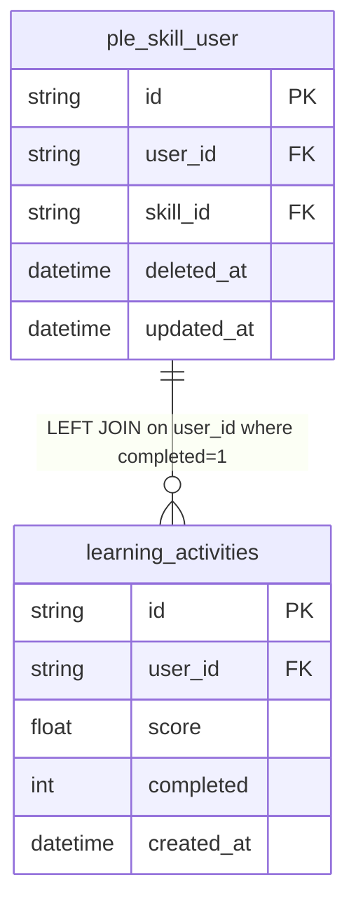

# fact_skill_scores Query Documentation

Source query: `queries/fact_skill_scores.sql`

This query produces skill score records by joining learner-skill mappings from `ple_skill_user` with completed learning activities to compute an average score per learner. It is intended to populate the DWH fact table `fact_skill_scores`, capturing assessed skill-level scores for PLE learners.

> **Production readiness warnings:**
> 1. The query contains a hardcoded `la.user_id IN ('0000ea31-8320-4974-b389-af6a2d725d44')` and `psu.user_id IN ('0000ea31-8320-4974-b389-af6a2d725d44')` filter. These restrict output to a single user and **must be removed before production use.**
> 2. The SELECT list contains a literal expression `1=1` which produces a meaningless boolean column and should be removed.
> 3. The `GROUP BY psu.user_id` groups only by user, not by skill. This means a user with multiple skills will have all their skills collapsed into a single row, producing incorrect or database-error results depending on the SQL mode. The correct GROUP BY should include `psu.id` (or both `psu.user_id` and `psu.skill_id`) to produce one row per skill-user combination as intended.

## Query Grain

Intended grain: one row per skill-user combination (`score_id`, `psu.id`). Actual grain due to `GROUP BY psu.user_id` only: one row per user, collapsing all skills. This is a logic bug — the GROUP BY must be corrected to `psu.id` or `psu.user_id, psu.skill_id` to match the intended grain.

## Incremental Configuration

| Setting | Value | Reason |
| --- | --- | --- |
| Source table | `quest_rearch_production.ple_skill_user` | Skill-user mapping identity and `updated_at` are driven from the skill-user record. |
| Source ID column (`id_col`) | `id` | Source primary key used by the pipeline to identify changed records. |
| Destination ID column (`dest_id_col`) | `score_id` | Output column used by the pipeline to delete and reload changed score rows. |
| Updated-at column | `updated_at` | Used by the pipeline to detect changed skill-user records for incremental refresh. |

## Global Filters

| Filter | Reason |
| --- | --- |
| `psu.deleted_at IS NULL` | Excludes soft-deleted skill-user records. |
| `la.completed = 1` | Restricts to completed learning activities (applied in both the JOIN condition and the WHERE clause). |
| `la.user_id IN ('0000ea31-8320-4974-b389-af6a2d725d44')` | **Development filter — hardcodes a single user UUID. Must be removed for production use.** |
| `psu.user_id IN ('0000ea31-8320-4974-b389-af6a2d725d44')` | **Development filter — hardcodes a single user UUID. Must be removed for production use.** |

## Output Columns

| Output column | Source table | Source column | Transform / logic | Reason for inclusion | Nullable in query |
| --- | --- | --- | --- | --- | --- |
| `score_id` | `quest_rearch_production.ple_skill_user` alias `psu` | `id` | Direct select: `psu.id AS score_id` | Primary fact grain key identifying the skill-user record. | No |
| `user_id` | `quest_rearch_production.ple_skill_user` alias `psu` | `user_id` | Direct select: `psu.user_id` | Links the score to the learner. | Depends on source schema |
| `skill_id` | `quest_rearch_production.ple_skill_user` alias `psu` | `skill_id` | Direct select: `psu.skill_id` | Identifies the skill being scored. | Depends on source schema |
| `score` | `quest_rearch_production.learning_activities` alias `la` | `score` | `AVG(la.score) AS score` — averages the score across all completed learning activities for the user. Due to incorrect GROUP BY, this averages across all skills for the user rather than per skill. | Captures the learner's average score for the skill. Requires GROUP BY fix to be correct. | Yes — `la` is LEFT joined; NULL if no matching learning activities. |
| `assessed_at` | `quest_rearch_production.learning_activities` alias `la` | `created_at` | Direct select: `la.created_at AS assessed_at` | Timestamp of the assessment event from the learning activity. | Yes — `la` is LEFT joined; NULL if no matching learning activities. |
| *(literal `1=1`)* | N/A | N/A | Evaluates to boolean `true` (or `1`). **Leftover debug expression — should be removed.** | No valid analytical purpose. | No |

## Entity Relationship Diagram

## Join and Cardinality Notes

| Join | Join type | Expected effect |
| --- | --- | --- |
| `ple_skill_user` to `learning_activities` | `LEFT JOIN` on `user_id` and `completed = 1` | Preserves skill-user rows even when no completed learning activities exist. One skill-user to many activities — fan-out collapsed by AVG aggregate. |

## DWH Interpretation

| Item | Value |
| --- | --- |
| Intended DWH table | `fact_skill_scores` |
| DWH grain risk | **Critical bug:** `GROUP BY psu.user_id` without `psu.skill_id` collapses all skills per user into one row, making `score_id` and `skill_id` non-deterministic. Fix by changing GROUP BY to `psu.id, psu.user_id, psu.skill_id, la.created_at`. Additionally, joining `learning_activities` only on `user_id` (not on a skill-to-activity mapping) may produce scores that blend activities from unrelated skills. |
| Production source schema | `quest_rearch_production` |
| DWH source status | The query reads from production source tables, not DWH tables. |
| Output DWH columns | `score_id`, `user_id`, `skill_id`, `score`, `assessed_at` |
