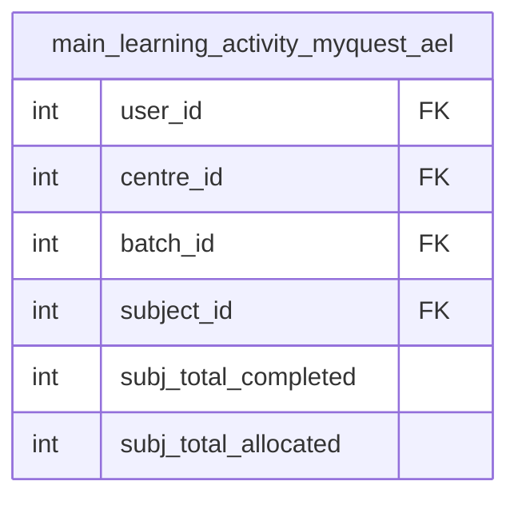

# fact_subject_progress Query Documentation

Source query: `queries/fact_subject_progress.sql`

This query produces per-learner, per-subject progress records from the pre-aggregated `main_learning_activity_myquest_ael` table in the analytics destination database. It rolls up completion and allocation counts to the subject level and derives a progress percentage, enabling subject-level completion analysis across learner, centre, and batch dimensions.

## Query Grain

One row per learner-subject combination (`user_id`, `subject_id`). The `GROUP BY` on `user_id, subject_id` collapses all rows for the same learner-subject pair from the source table.

## Incremental Configuration

This query uses `-- @dest_only` and reads from the analytics destination database (`myquest_data_model`), not the production source. Incremental mode is not configured. The pipeline runs a full replace on each execution.

## Global Filters

No global filters are applied. All rows from `main_learning_activity_myquest_ael` are included.

## Output Columns

| Output column | Source table | Source column | Transform / logic | Reason for inclusion | Nullable in query |
| --- | --- | --- | --- | --- | --- |
| `user_id` | `quest_analytics.main_learning_activity_myquest_ael` alias `m` | `user_id` | Direct select: `m.user_id` | Identifies the learner. Forms part of the fact grain. | Depends on source |
| `centre_id` | `quest_analytics.main_learning_activity_myquest_ael` alias `m` | `centre_id` | Direct select: `m.centre_id` | Links the record to the learner's centre. | Depends on source |
| `batch_id` | `quest_analytics.main_learning_activity_myquest_ael` alias `m` | `batch_id` | Direct select: `m.batch_id` | Links the record to the learner's batch. | Depends on source |
| `subject_id` | `quest_analytics.main_learning_activity_myquest_ael` alias `m` | `subject_id` | Direct select: `m.subject_id` | Links the record to the subject dimension. Forms part of the fact grain. | Depends on source |
| `subj_total_completed` | `quest_analytics.main_learning_activity_myquest_ael` alias `m` | `subj_total_completed` | Direct select: `m.subj_total_completed` | Total lessons completed by the learner within the subject. | Depends on source |
| `subj_total_allocated` | `quest_analytics.main_learning_activity_myquest_ael` alias `m` | `subj_total_allocated` | Direct select: `m.subj_total_allocated` | Total lessons allocated to the learner within the subject. Used as denominator for progress percentage. | Depends on source |
| `progress_pct` | `quest_analytics.main_learning_activity_myquest_ael` alias `m` | `subj_total_completed`, `subj_total_allocated` | `(m.subj_total_completed / m.subj_total_allocated) * 100` | Derived completion percentage for the subject. Will be `NULL` or produce a divide-by-zero error if `subj_total_allocated` is 0. | Yes — if `subj_total_allocated` is NULL or 0 |

> **Note:** `progress_pct` has no guard against division by zero. If `subj_total_allocated = 0`, MySQL returns `NULL` silently, but this should be validated downstream.

## Entity Relationship Diagram

This query reads from a single pre-aggregated table — no joins are performed.

## Join and Cardinality Notes

No joins. The query selects and groups directly from the pre-aggregated `main_learning_activity_myquest_ael` table.

## DWH Interpretation

| Item | Value |
| --- | --- |
| Intended DWH table | `fact_subject_progress` |
| DWH grain risk | If the source table `main_learning_activity_myquest_ael` has multiple rows per `(user_id, subject_id)` pair (e.g. different `centre_id` or `batch_id` values), the `GROUP BY user_id, subject_id` will silently collapse them, taking an arbitrary value for `centre_id`, `batch_id`, `subj_total_completed`, and `subj_total_allocated`. Consider extending the `GROUP BY` to include `centre_id` and `batch_id` if multiple rows per learner-subject are expected. |
| Source schema | `myquest_data_model` (destination / analytics DB) |
| DWH source status | Reads from a pre-aggregated analytics table, not directly from the production source. The `@dest_only` flag is set — the pipeline connects to the destination DB for this query. |
| Output DWH columns | `user_id`, `centre_id`, `batch_id`, `subject_id`, `subj_total_completed`, `subj_total_allocated`, `progress_pct` |
