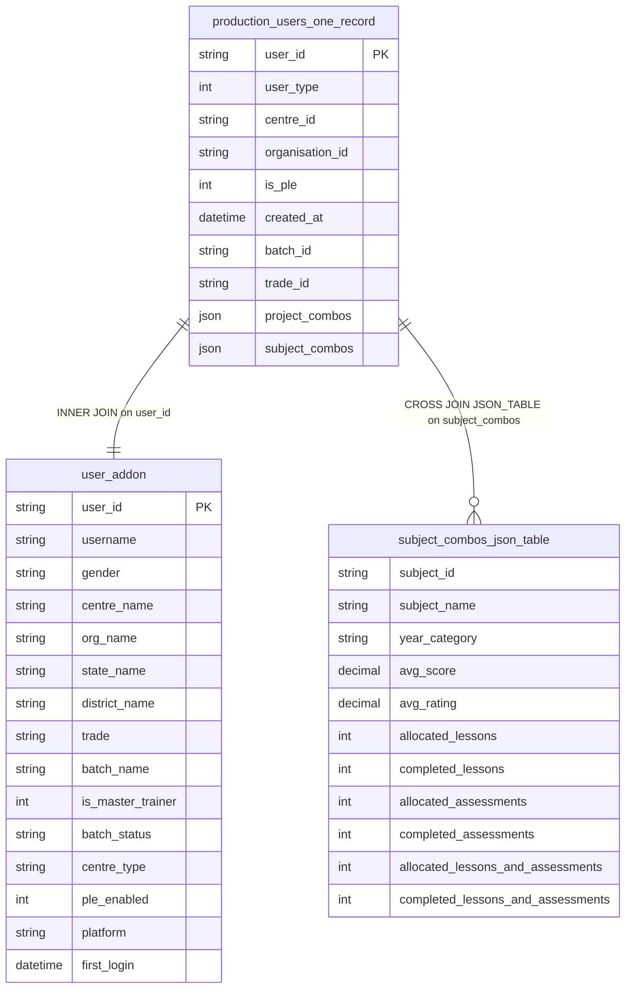

# fact_subject_progress Query Documentation

Source query: `queries/fact_subject_progress.sql`

This query produces per-learner, per-subject progress records by unnesting the `subject_combos` JSON array stored on each learner's one-record summary (`production_users_one_record`) in the analytics destination database, and enriching it with display attributes from `user_addon`. It supports subject-level completion, score, and rating analysis per learner, filtered to learners enrolled in the `MyQuest` or `Quest Experience Lab` programs.

## Query Grain

One row per learner-subject combination (`tlo_users_id`, `subject_id`). `production_users_one_record` holds one row per learner with `subject_combos` as a JSON array of that learner's subjects; `JSON_TABLE` expands that array into one row per element, joined 1:1 back to the learner record. No `GROUP BY` is used or needed — the fan-out is intentional and bounded by the number of subjects per learner.

## Incremental Configuration

This query uses `-- @dest_only` and reads from the analytics destination database (`myquest_data_model`), not the production source. Incremental mode is not configured. The pipeline runs a full replace on each execution.

## Global Filters

| Filter | Reason |
| --- | --- |
| `a.subject_combos IS NOT NULL` | Excludes learners with no subject allocation data — `JSON_TABLE` would produce no rows for these regardless, but the filter makes the intent explicit. |
| `JSON_UNQUOTE(JSON_EXTRACT(a.project_combos, '$[0].prog_name')) IN ('MyQuest', 'Quest Experience Lab')` | Restricts output to learners whose first listed project is one of these two programs. |

## Output Columns

| Output column | Source table | Source column | Transform / logic | Reason for inclusion | Nullable in query |
| --- | --- | --- | --- | --- | --- |
| `tlo_users_id` | `quest_analytics.production_users_one_record` alias `a` | `user_id` | Direct select: `a.user_id AS tlo_users_id` | Identifies the learner. Forms part of the fact grain. | No |
| `user_type_e` | `quest_analytics.production_users_one_record` alias `a`, `user_addon` alias `b` | `user_type`, `is_master_trainer` | `CASE` mapping `user_type` (1–4) to a readable label, distinguishing Master Trainer from Facilitator using `b.is_master_trainer` | Human-readable role label for reporting. | Falls back to `'Missing Data'` if `user_type` doesn't match 1–4. |
| `is_ple` | `quest_analytics.production_users_one_record` alias `a` | `is_ple` | Direct select: `a.is_ple` | Flags whether the learner is on the PLE (Personalised Learning Experience) path. | Depends on source |
| `project_combos` | `quest_analytics.production_users_one_record` alias `a` | `project_combos` | Direct select: `a.project_combos` | Raw JSON of the learner's project/program allocations, passed through for downstream consumers. | Depends on source |
| `user_name` | `quest_analytics.user_addon` alias `b` | `username` | Direct select: `b.username AS user_name` | Display name for the learner. | Depends on source |
| `gender` | `quest_analytics.user_addon` alias `b` | `gender` | Direct select: `b.gender` | Learner demographic attribute. | Depends on source |
| `centre_name`, `org_name`, `state_name`, `district_name`, `trade`, `batch_name`, `batch_status`, `centre_type`, `platform`, `ple_enabled`, `first_login`, `is_master_trainer` | `quest_analytics.user_addon` alias `b` | same-named columns | Direct select from `b` | Denormalised display attributes for the learner's centre, batch, and platform context, avoiding joins back to production dimension tables. | Depends on source |
| `subject_combos` | `quest_analytics.production_users_one_record` alias `a` | `subject_combos` | Direct select: `a.subject_combos` | Raw JSON array of the learner's subject-level progress, passed through alongside the unnested columns below. | No — filtered to `IS NOT NULL` |
| `subject_id`, `subject_name`, `year_category`, `avg_score`, `avg_rating`, `allocated_lessons`, `completed_lessons`, `allocated_assessments`, `completed_assessments`, `allocated_lessons_and_assessments`, `completed_lessons_and_assessments` | `quest_analytics.production_users_one_record` alias `a`, via `JSON_TABLE(a.subject_combos, '$[*]' COLUMNS (...))` aliased `s` | fields of each JSON element in `subject_combos` | `JSON_TABLE` extracts each field from every element of the `subject_combos` array as a relational column, producing one row per subject per learner | Provides subject-level progress metrics without a second round trip or manual JSON parsing downstream. | Depends on which fields are present in each JSON element |

## Entity Relationship Diagram

## Join and Cardinality Notes

| Join | Join type | Expected effect |
| --- | --- | --- |
| `production_users_one_record` to `user_addon` | `INNER JOIN` on `user_id` | Excludes learners with no matching `user_addon` row. Each learner maps to exactly one addon record. |
| `production_users_one_record` to `JSON_TABLE(subject_combos)` | `CROSS JOIN` | Expands the `subject_combos` JSON array into one row per subject. A learner with N subjects produces N output rows; a learner with an empty or `NULL` array produces zero rows. This is the intended fan-out — it is the fact grain, not a bug. |

## DWH Interpretation

| Item | Value |
| --- | --- |
| Intended DWH table | `fact_subject_progress` |
| DWH grain risk | Grain is one row per `(tlo_users_id, subject_id)`, driven entirely by the contents of the upstream `subject_combos` JSON column. If `production_users_one_record` ever contains duplicate subject entries within the same learner's array, this table will inherit those duplicates — there is no dedup step. |
| Source schema | `myquest_data_model` (destination / analytics DB), reading from the `quest_analytics` tables materialised there |
| DWH source status | Reads from pre-aggregated analytics tables, not directly from the production source. The `@dest_only` flag is set — the pipeline connects to the destination DB for this query. |
| Output DWH columns | `tlo_users_id`, `user_type_e`, `is_ple`, `project_combos`, `user_name`, `gender`, `centre_name`, `org_name`, `state_name`, `district_name`, `trade`, `batch_name`, `batch_status`, `centre_type`, `platform`, `ple_enabled`, `first_login`, `is_master_trainer`, `subject_combos`, `subject_id`, `subject_name`, `year_category`, `avg_score`, `avg_rating`, `allocated_lessons`, `completed_lessons`, `allocated_assessments`, `completed_assessments`, `allocated_lessons_and_assessments`, `completed_lessons_and_assessments` |
