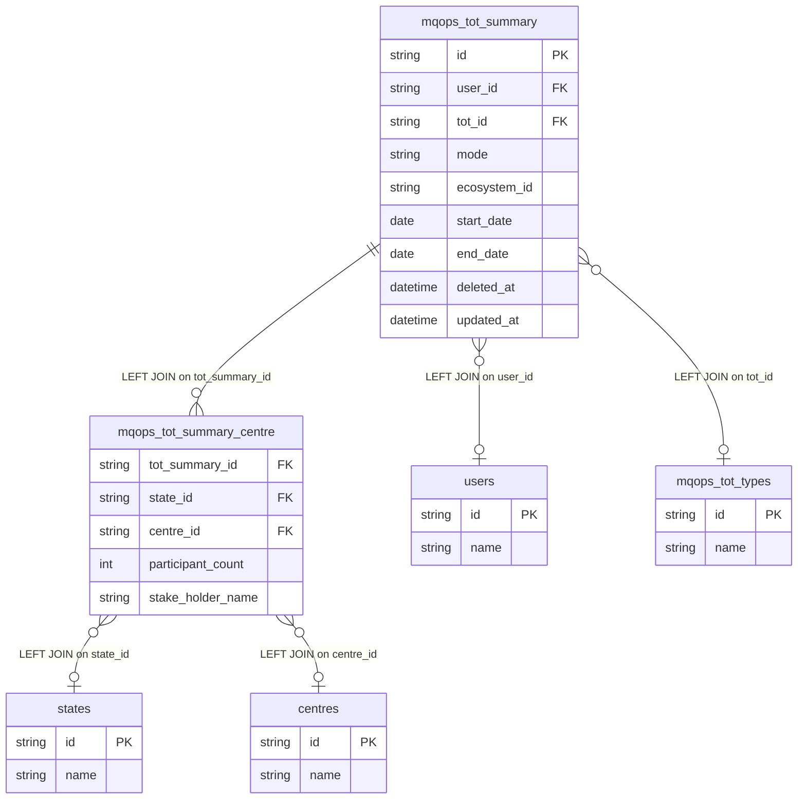

# fact_tot_session Query Documentation

Source query: `queries/fact_tot_session.sql`

This query produces Training of Trainers (ToT) session summary records, enriched with facilitator, ToT type, state, centre, and participant-count details. It is intended to populate the DWH fact table `fact_tot_session` for reporting on ToT delivery and attendance across centres and states.

## Query Grain

One row per ToT summary-centre/stakeholder row from `mqops_tot_summary_centre`. A single ToT summary (`tot_summary_id`) can produce multiple output rows when it is linked to multiple centres or stakeholder rows.

## Incremental Configuration

| Setting | Value | Reason |
| --- | --- | --- |
| Source table | `quest_rearch_production.mqops_tot_summary` | ToT summary identity and `updated_at` are driven from the summary record. |
| Source ID column (`id_col`) | `id` | Source primary key used by the pipeline to identify changed records. |
| Destination ID column (`dest_id_col`) | `tot_summary_id` | Output column used by the pipeline to delete and reload all rows for changed ToT summaries. |
| Updated-at column | `updated_at` | Used by the pipeline to detect changed ToT summary records for incremental refresh. |

## Global Filters

| Filter | Reason |
| --- | --- |
| `mts.deleted_at IS NULL` | Excludes soft-deleted ToT summary records. |

## Output Columns

| Output column | Source table | Source column | Transform / logic | Reason for inclusion | Nullable in query |
| --- | --- | --- | --- | --- | --- |
| `tot_summary_id` | `quest_rearch_production.mqops_tot_summary` alias `mts` | `id` | Direct select: `mts.id AS tot_summary_id` | Identifies the parent ToT summary record. | No |
| `user_name` | `quest_rearch_production.users` alias `u` | `name` | Resolved via LEFT JOIN on `mts.user_id = u.id` | Human-readable name of the user associated with the ToT summary. | Yes — `users` is LEFT joined. |
| `state_name` | `quest_rearch_production.states` alias `s` | `name` | Resolved via `mqops_tot_summary_centre.state_id` | Human-readable state for the ToT centre/stakeholder row. | Yes — `states` is LEFT joined. |
| `mode` | `quest_rearch_production.mqops_tot_summary` alias `mts` | `mode` | Direct select | ToT delivery mode. | Depends on source schema |
| `ecosystem_id` | `quest_rearch_production.mqops_tot_summary` alias `mts` | `ecosystem_id` | Direct select | Ecosystem reference captured on the ToT summary. | Depends on source schema |
| `participant_count` | `quest_rearch_production.mqops_tot_summary_centre` alias `mtsp` | `participant_count` | Direct select | Total participants for the centre/stakeholder row. | Yes — bridge table is LEFT joined. |
| `female_participant_count` | `quest_rearch_production.mqops_tot_summary_centre` alias `mtsp` | `female_participant_count` | Direct select | Female participant count. | Yes — bridge table is LEFT joined. |
| `male_participant_count` | `quest_rearch_production.mqops_tot_summary_centre` alias `mtsp` | `male_participant_count` | Direct select | Male participant count. | Yes — bridge table is LEFT joined. |
| `other_participant_count` | `quest_rearch_production.mqops_tot_summary_centre` alias `mtsp` | `other_participant_count` | Direct select | Other gender participant count. | Yes — bridge table is LEFT joined. |
| `tot_name` | `quest_rearch_production.mqops_tot_types` alias `mtt` | `name` | Resolved via LEFT JOIN on `mts.tot_id = mtt.id` | Human-readable ToT type/name. | Yes — `mqops_tot_types` is LEFT joined. |
| `start_date` | `quest_rearch_production.mqops_tot_summary` alias `mts` | `start_date` | Direct select | ToT start date. | Depends on source schema |
| `end_date` | `quest_rearch_production.mqops_tot_summary` alias `mts` | `end_date` | Direct select | ToT end date. | Depends on source schema |
| `centre_name` | `quest_rearch_production.centres` alias `c` | `name` | Resolved via `mqops_tot_summary_centre.centre_id` | Human-readable centre name. | Yes — `centres` is LEFT joined. |
| `stake_holder_name` | `quest_rearch_production.mqops_tot_summary_centre` alias `mtsp` | `stake_holder_name` | Direct select | Stakeholder name captured for the centre row. | Yes — bridge table is LEFT joined. |
| `updated_at` | `quest_rearch_production.mqops_tot_summary` alias `mts` | `updated_at` | Direct select | Supports auditability and incremental refresh tracking. | Depends on source schema |

## Entity Relationship Diagram

## Join and Cardinality Notes

| Join | Join type | Expected effect |
| --- | --- | --- |
| `mqops_tot_summary` to `mqops_tot_summary_centre` | `LEFT JOIN` | Preserves ToT summaries without centre rows, but can produce multiple rows per `tot_summary_id` when multiple centre/stakeholder rows exist. |
| `mqops_tot_summary` to `users` | `LEFT JOIN` | Resolves user name while preserving summaries with missing user lookup rows. |
| `mqops_tot_summary` to `mqops_tot_types` | `LEFT JOIN` | Resolves ToT type/name while preserving summaries with missing type lookup rows. |
| `mqops_tot_summary_centre` to `states` | `LEFT JOIN` | Resolves state name for each centre/stakeholder row. |
| `mqops_tot_summary_centre` to `centres` | `LEFT JOIN` | Resolves centre name for each centre/stakeholder row. |

## DWH Interpretation

| Item | Value |
| --- | --- |
| Intended DWH table | `fact_tot_session` |
| DWH grain risk | Expected fan-out by centre/stakeholder rows. This is valid if the intended fact grain is ToT summary-centre/stakeholder. If the destination must be one row per ToT summary, aggregate the centre-level rows before loading. |
| Production source schema | `quest_rearch_production` |
| DWH source status | The query reads from production source tables, not DWH tables. |
| Output DWH columns | `tot_summary_id`, `user_name`, `state_name`, `mode`, `ecosystem_id`, `participant_count`, `female_participant_count`, `male_participant_count`, `other_participant_count`, `tot_name`, `start_date`, `end_date`, `centre_name`, `stake_holder_name`, `updated_at` |
