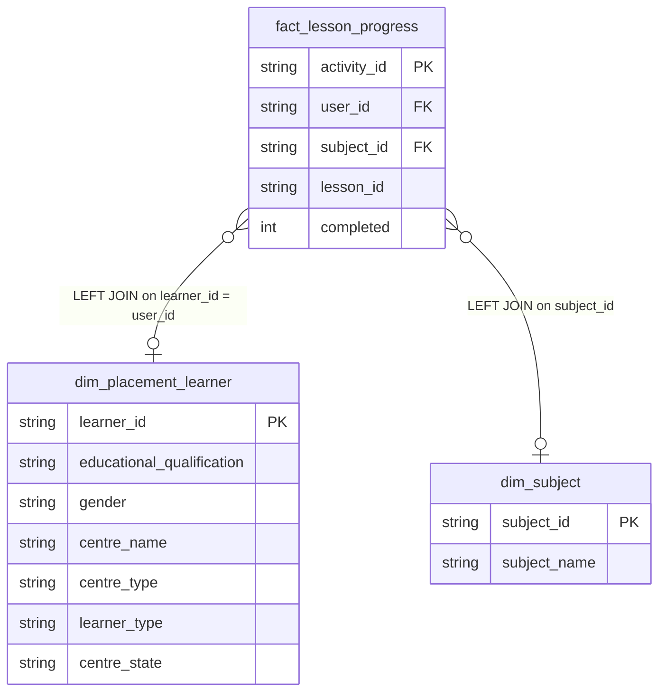

# mat_learning_activity Documentation

Source: `python_query/mat_learning_activity.py` (**not** a `queries/*.sql` file)

> **This is a standalone Python script, not part of the automated `main.py` pipeline.** `main.py` only scans `.sql` files in `queries/`, so this script must be run separately, and strictly after both `main.py` and `python_query/fact_lesson_progress.py`:
> ```bash
> python main.py --full-refresh && python python_query/fact_lesson_progress.py && python python_query/mat_learning_activity.py
> ```

## Why this is a Python script, not a query file

All three source tables (`fact_lesson_progress`, `dim_placement_learner`, `dim_subject`) live in the destination DB, so — unlike `fact_lesson_progress.py` — this doesn't need the cross-database temp-table bridging pattern. It's still not a `queries/*.sql` file, though, because of **dependency ordering**: `fact_lesson_progress` is itself only built by a separate script that runs after `main.py`. If this query lived in `queries/`, a bare `main.py --full-refresh` would try to run it automatically, mixed in with every other query, before `fact_lesson_progress` had been refreshed for that run (or, on a brand-new setup, before the table even exists at all — which would crash the whole `main.py` run and break the `&&`-chained command before `fact_lesson_progress.py` ever got to run).

## Grain

One row per `fact_lesson_progress` row (i.e. one row per completed learning activity for a learner-subject pair already tracked in `fact_subject_progress` — see [docs/fact_lesson_progress.md](docs/fact_lesson_progress.md) for that grain's origin), enriched with learner and subject display attributes. Both enrichment joins are `LEFT JOIN`s, so no `fact_lesson_progress` row is dropped for missing dimension data.

## How it works

1. Opens **two separate connections** to the destination DB — one for reading, one for writing. This is required even though both point at the same database: MySQL doesn't allow issuing a new query on a connection while an unbuffered (`SSCursor`) result set from an earlier query is still being streamed, so a single shared connection would fail with "commands out of sync" once the first write is attempted mid-stream.
2. Streams `SELECT_SQL` via the read connection in `QUERY_FETCH_CHUNK_SIZE`-row batches.
3. Writes each batch to `mat_learning_activity` via the write connection using `_write_with_conn` — the first batch does `if_exists="replace"`, subsequent batches `"append"`.

## Output Columns

| Output column | Source table | Source column | Transform / logic | Nullable |
| --- | --- | --- | --- | --- |
| `activity_id` | `fact_lesson_progress` alias `flp` | `activity_id` | Direct select | No |
| `user_id` | `fact_lesson_progress` alias `flp` | `user_id` | Direct select | No |
| `subject_id` | `fact_lesson_progress` alias `flp` | `subject_id` | Direct select | Depends on source |
| `lesson_id` | `fact_lesson_progress` alias `flp` | `lesson_id` | Direct select | Depends on source |
| `course_id` | `fact_lesson_progress` alias `flp` | `course_id` | Direct select | Depends on source |
| `lesson_name` | `fact_lesson_progress` alias `flp` | `lesson_name` | Direct select | Depends on source |
| `lesson_order` | `fact_lesson_progress` alias `flp` | `lesson_order` | Direct select | Depends on source |
| `is_assessment` | `fact_lesson_progress` alias `flp` | `is_assessment` | Direct select | Depends on source |
| `score` | `fact_lesson_progress` alias `flp` | `score` | Direct select | Depends on source |
| `rating` | `fact_lesson_progress` alias `flp` | `rating` | Direct select | Depends on source |
| `duration` | `fact_lesson_progress` alias `flp` | `duration` | Direct select | Depends on source |
| `created_at` | `fact_lesson_progress` alias `flp` | `created_at` | Direct select | Depends on source |
| `completed` | `fact_lesson_progress` alias `flp` | `completed` | Direct select | No — `fact_lesson_progress` only contains completed activities |
| `completed_at` | `fact_lesson_progress` alias `flp` | `completed_at` | Direct select | Depends on source |
| `educational_qualification` | `dim_placement_learner` alias `dlp` | `educational_qualification` | `LEFT JOIN` on `dlp.learner_id = flp.user_id` | Yes — `dim_placement_learner` is `LEFT JOIN`ed |
| `gender` | `dim_placement_learner` alias `dlp` | `gender` | `LEFT JOIN` lookup | Yes |
| `centre_name` | `dim_placement_learner` alias `dlp` | `centre_name` | `LEFT JOIN` lookup | Yes |
| `centre_type` | `dim_placement_learner` alias `dlp` | `centre_type` | `LEFT JOIN` lookup | Yes |
| `learner_type` | `dim_placement_learner` alias `dlp` | `learner_type` | `LEFT JOIN` lookup | Yes |
| `centre_state` | `dim_placement_learner` alias `dlp` | `centre_state` | `LEFT JOIN` lookup | Yes |
| `subject_name` | `dim_subject` alias `ds` | `subject_name` | `LEFT JOIN` on `ds.subject_id = flp.subject_id` | Yes — `dim_subject` is `LEFT JOIN`ed |

## Entity Relationship Diagram



## Join and Cardinality Notes

| Join | Join type | Expected effect |
| --- | --- | --- |
| `fact_lesson_progress` to `dim_placement_learner` | `LEFT JOIN` | Preserves every activity row even if the learner isn't (yet) present in `dim_placement_learner` (e.g. filtered out there by status/deleted_at/qualification joins); enrichment columns are `NULL` in that case. |
| `fact_lesson_progress` to `dim_subject` | `LEFT JOIN` | Preserves every activity row even if the subject isn't in `dim_subject`; `subject_name` is `NULL` in that case. |
| `dim_placement_learner` fan-out risk | N/A here | If `dim_placement_learner` ever has more than one row per `learner_id` (documented fan-out risk from `centre_project` — see [docs/dim_placement_learner_query_columns.md](docs/dim_placement_learner_query_columns.md)), this join would multiply `fact_lesson_progress` rows accordingly. |

## DWH Interpretation

| Item | Value |
| --- | --- |
| Intended DWH table | `mat_learning_activity` |
| DWH grain risk | Inherits any fan-out from `dim_placement_learner` (see above). Otherwise one row per `fact_lesson_progress` row. |
| Source schema | `myquest_data_model` (destination DB only — all three source tables) |
| DWH source status | Reads exclusively from destination-DB tables built by earlier pipeline steps; not expressible as a `queries/*.sql` file due to run-order dependencies (see above), not due to cross-database bridging. |
| Output DWH columns | `activity_id`, `user_id`, `subject_id`, `lesson_id`, `course_id`, `lesson_name`, `lesson_order`, `is_assessment`, `score`, `rating`, `duration`, `created_at`, `completed`, `completed_at`, `educational_qualification`, `gender`, `centre_name`, `centre_type`, `learner_type`, `centre_state`, `subject_name` |
